# 1. Процедуры. Синтаксис объявления процедур. Вызов процедуры. Организация связи по данным при использовании процедур без параметров. Пример.

**Подпрограмма** — это поименованная, логически законченная группа операторов языка, которую можно вызвать для выполнения по имени любое количество раз из разных мест программы. В языке Pascal подпрограммы делятся на процедуры и функции.

Структура любой подпрограммы состоит из заголовка и тела.

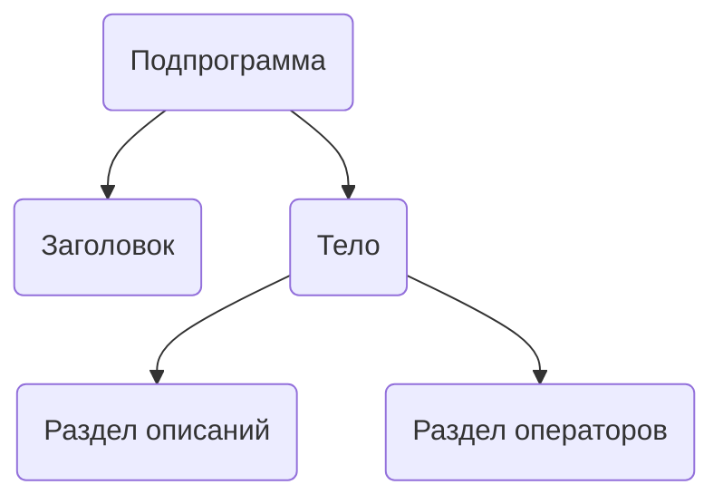

### Синтаксис объявления и вызова процедуры

**Объявление процедуры:**
```pascal
procedure <Имя_процедуры>(<Список_формальных_параметров>);
// Раздел локальных описаний (переменные, константы, типы)
begin
  // Тело процедуры (операторы)
end;
```

**Вызов процедуры:**
Вызов осуществляется по имени процедуры с указанием списка фактических параметров в скобках.
```pascal
<Имя_процедуры>(<Список_фактических_параметров>);
```

### Организация связи через глобальные переменные

Процедуры без параметров не могут принимать данные через аргументы. Единственный способ обмена данными с основной программой для таких процедур — использование **глобальных переменных**, то есть переменных, объявленных в основном блоке программы.

Такой подход считается **дурным тоном** в программировании по следующим причинам:
*   **Сложность повторного использования:** Процедуру, жестко привязанную к глобальным переменным, практически невозможно без изменений перенести в другую программу.
*   **Усложнение логики:** Если несколько процедур используют одну и ту же глобальную переменную, отследить ее изменения становится очень сложно, что ведет к ошибкам.
*   **Низкая гибкость:** Процедура не может работать с разными данными в разных частях программы, так как она всегда обращается к одним и тем же глобальным переменным.

### Пример

В данном примере процедура `CalcDist` не имеет параметров и для вычислений использует глобальные переменные `X1`, `X2`, `Y1`, `Y2`, а результат записывает в глобальную переменную `D`.

```pascal
program GlobalVarExample;

var
  // Глобальные переменные, доступные везде
  X1, X2, Y1, Y2, D: Real;

// Процедура без параметров
procedure CalcDist();
begin
  // Работает напрямую с глобальными переменными
  D := Sqrt(Sqr(X1 - X2) + Sqr(Y1 - Y2));
end;

begin
  // Присваиваем значения глобальным переменным
  X1 := 0; Y1 := 0;
  X2 := 3; Y2 := 4;

  // Вызываем процедуру, которая использует эти переменные
  CalcDist();

  // Выводим результат, который процедура записала в D
  WriteLn('Расстояние между точками: ', D:0:2);
  ReadLn;
end.
```

---

# 2. Виды формальных параметров подпрограмм. Параметры-значения. Назначение, синтаксис. Механизм организации взаимосвязи с фактическими параметрами при использовании параметров-значений. Пример.

**Параметры** служат для обмена данными между вызывающей программой и подпрограммой.
*   **Формальные параметры** — переменные, которые объявляются в заголовке подпрограммы.
*   **Фактические параметры** — выражения или переменные, которые передаются в подпрограмму при ее вызове.

Основные виды формальных параметров в Pascal:
*   Параметры-значения
*   Параметры-переменные (`var`)
*   Параметры-константы (`const`)

### Параметры-значения

**Назначение:** Используются для передачи входных данных в подпрограмму. Этот способ защищает исходные данные от изменений внутри подпрограммы.

**Синтаксис:** В заголовке подпрограммы указывается имя параметра и его тип, без служебных слов.
```pascal
procedure MyProc(ParamName: ParamType);
```

### Механизм взаимосвязи

При вызове подпрограммы с параметром-значением происходит следующий процесс:
1.  Вычисляется значение фактического параметра.
2.  В специальной области памяти, называемой **стеком**, создается **локальная копия** фактического параметра.
3.  Внутри подпрограммы все операции выполняются именно с этой локальной копией.
4.  Любые изменения, внесенные в эту копию, **не влияют** на исходный фактический параметр в вызывающей программе.
5.  После завершения работы подпрограммы ее локальная копия уничтожается.

**Особенность:** В качестве фактического параметра может выступать любое выражение, тип которого совместим с типом формального параметра.

```mermaid
graph LR
    subgraph "Вызывающий код"
        A[Фактический параметр<br>MyVar = 10]
    end
    
    subgraph "Подпрограмма MyProc(P: Integer)"
        B(Локальная переменная-копия<br>P = 10)
    end
    
    A --"1. Копируется значение в стек"--> B
    B --"2. Внутри процедуры P изменяется<br>P := P + 5"--> C(P = 15)
    C --"3. Изменение не влияет на оригинал"-.-> A

    linkStyle 2 stroke-dasharray: 5 5;
```

### Пример

В этом примере переменная `MyNumber` передается в процедуру `ChangeValue` как параметр-значение. Внутри процедуры ее локальная копия `ANumber` изменяется, но оригинальная переменная `MyNumber` остается неизменной.

```pascal
program ValueParamExample;

var
  MyNumber: Integer;

// ANumber - параметр-значение
procedure ChangeValue(ANumber: Integer);
begin
  WriteLn('Внутри процедуры (до изменения): ', ANumber);
  ANumber := 100; // Изменяем локальную копию
  WriteLn('Внутри процедуры (после изменения): ', ANumber);
end;

begin
  MyNumber := 42;
  WriteLn('В основном коде (до вызова): ', MyNumber);

  // Передаем MyNumber. Создается его копия ANumber.
  ChangeValue(MyNumber);

  WriteLn('В основном коде (после вызова): ', MyNumber); // Значение останется 42
  ReadLn;
end.
```
**Результат выполнения:**
```
В основном коде (до вызова): 42
Внутри процедуры (до изменения): 42
Внутри процедуры (после изменения): 100
В основном коде (после вызова): 42
```
---

# 3. Параметры-переменные и параметры-константы. Назначение, синтаксис. Механизм организации взаимосвязи с фактическими параметрами при использовании параметров-переменных и параметров-констант. Пример.

### Параметры-переменные (`var`)

**Назначение:** Используются для передачи данных из подпрограммы обратно в вызывающий код. Позволяют изменять исходные переменные.

**Синтаксис:** В заголовке перед именем параметра указывается зарезервированное слово `var`.
```pascal
procedure MyProc(var ParamName: ParamType);
```

**Механизм взаимосвязи:**
1.  При вызове подпрограммы в стек передаётся не значение, а **адрес** фактического параметра в памяти.
2.  Формальный параметр становится псевдонимом (синонимом) для фактического параметра — они оба указывают на одну и ту же область памяти.
3.  Любое изменение формального параметра внутри подпрограммы **напрямую изменяет** значение фактического параметра.
4.  **Ограничение:** В качестве фактического параметра может выступать только **переменная** того же типа, но не выражение или константа.

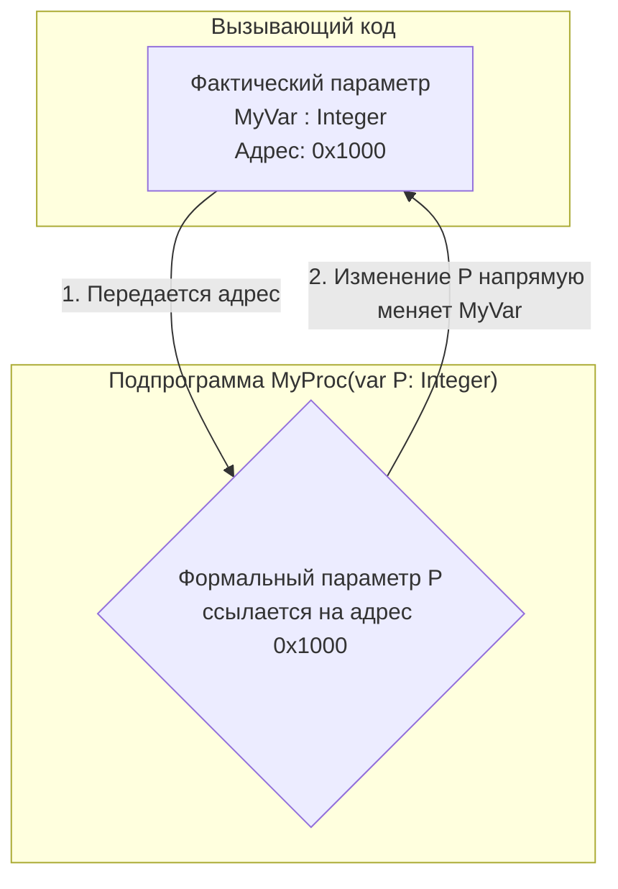

### Параметры-константы (`const`)

**Назначение:** Используются для передачи в подпрограмму данных, которые не должны быть изменены. Это повышает безопасность кода и часто является наиболее эффективным способом передачи, особенно для больших типов данных.

**Синтаксис:** В заголовке перед именем параметра указывается зарезервированное слово `const`.
```pascal
procedure MyProc(const ParamName: ParamType);
```

**Механизм взаимосвязи:**
1.  **Способ передачи выбирается компилятором.** Для простых типов (Integer, Char) обычно создается копия (как у параметра-значения). Для сложных типов (строки, записи, массивы) передается адрес (как у параметра-переменной), чтобы избежать затратного копирования большого объема данных.
2.  Главное свойство: компилятор **запрещает** любые операции, изменяющие значение формального параметра внутри подпрограммы. Попытка присвоить ему новое значение вызовет ошибку компиляции.
3.  В качестве фактического параметра может выступать любое **выражение** совместимого типа.

### Пример

```pascal
program VarConstExample;

var
  A, B: Integer;
  S: string;

// Процедура меняет местами значения двух переменных
// X и Y - параметры-переменные
procedure Swap(var X, Y: Integer);
var
  Temp: Integer;
begin
  Temp := X;
  X := Y;
  Y := Temp;
end;

// Процедура выводит строку, не изменяя ее
// Str - параметр-константа
procedure PrintString(const Str: string);
begin
  WriteLn(Str);
  // Str := 'New'; // Эта строка вызовет ошибку компиляции
end;

begin
  A := 10;
  B := 20;
  WriteLn('До обмена: A = ', A, ', B = ', B);
  Swap(A, B); // Передаем переменные, они будут изменены
  WriteLn('После обмена: A = ', A, ', B = ', B);

  S := 'Это исходная строка';
  PrintString(S); // Передаем для эффективного чтения
  PrintString('Это строковый литерал'); // Можно передавать выражения
  ReadLn;
end.
```
---

# 4. Параметры без типа. Назначение, синтаксис. Способы обеспечения совместимости с фактическими параметрами. Примеры.

**Параметры без типа (untyped)** — это особый вид формальных параметров, для которых в заголовке подпрограммы не указывается тип данных. Они могут быть только `var` или `const` параметрами, но не параметрами-значениями.

**Назначение:** Позволяют создавать универсальные подпрограммы, которые могут обрабатывать данные абсолютно любого типа. Это полезно для низкоуровневых операций, таких как копирование блоков памяти, сохранение/загрузка данных в сыром виде и т.д.

**Синтаксис:**
```pascal
procedure GenericProc(var Data);
procedure GenericConstProc(const Data);
```
Фактическим параметром при вызове может быть переменная **любого типа**.

### Способы обеспечения совместимости

Поскольку тип параметра неизвестен, напрямую работать с ним нельзя. Для работы с данными, переданными через бестиповой параметр, существует два основных способа:

**1. Использование директивы `absolute`**

Внутри подпрограммы объявляется локальная переменная нужного типа, которая с помощью директивы `absolute` "накладывается" на ту же область памяти, которую занимает бестиповой параметр. Это позволяет интерпретировать переданные байты как данные конкретного типа. Чаще всего используется массив байт для побайтового доступа.

**2. Явное приведение типов**

Внутри подпрограммы бестиповой параметр явно приводится к нужному типу данных. Это позволяет компилятору временно рассматривать бестиповую переменную как переменную конкретного типа и выполнять соответствующие операции.

### Примеры

Рассмотрим процедуру, которая копирует `Count` байт из одного места в памяти (`Source`) в другое (`Dest`).

**Пример с директивой `absolute`:**

```pascal
// Копирование данных с использованием absolute
procedure CopyMemory_Absolute(const Source; var Dest; Count: Integer);
type
  TByteArray = array[0..MaxInt-1] of Byte;
var
  // S и D - это просто другие "имена" для тех же областей памяти,
  // что и Source и Dest, но с известным типом.
  S: TByteArray absolute Source;
  D: TByteArray absolute Dest;
  I: Integer;
begin
  for I := 0 to Count - 1 do
    D[I] := S[I];
end;
```

**Пример с приведением типов:**

```pascal
// Копирование данных с использованием приведения типов
procedure CopyMemory_TypeCast(const Source; var Dest; Count: Integer);
type
  TByteArray = array[0..MaxInt-1] of Byte;
  PByteArray = ^TByteArray; // Указатель на массив байт
var
  I: Integer;
begin
  for I := 0 to Count - 1 do
    // Приводим бестиповые параметры к указателям, разыменовываем их
    // и работаем как с массивами.
    PByteArray(@Dest)^[I] := PByteArray(@Source)^[I];

    // Альтернативный, более современный синтаксис в Delphi:
    // TByteArray(Dest)[I] := TByteArray(Source)[I];
end;
```
Оба способа решают одну и ту же задачу — обеспечивают типизированный доступ к данным, переданным через бестиповой параметр.

---
# 5. Параметры open array. Назначение, синтаксис. Механизм организации взаимосвязи с фактическими параметрами при использовании параметров open array. Совместимость с фактическими параметрами. Пример.

**Open array (открытый массив)** — это специальный механизм в Pascal/Delphi, который позволяет передавать в подпрограмму в качестве параметра одномерные массивы разной длины.

**Назначение:** Создание универсальных подпрограмм для обработки массивов, размер которых неизвестен на этапе компиляции. Это избавляет от необходимости писать отдельные процедуры для массивов разного размера.

**Важное замечание:** Параметр типа `open array` — это **не** динамический массив. Это специальный синтаксис для передачи параметров.

**Синтаксис:** В заголовке подпрограммы вместо имени типа массива используется конструкция `array of <Базовый_тип>`.
```pascal
procedure ProcessArray(var A: array of Integer);
```

### Механизм взаимосвязи

При вызове подпрограммы с параметром `open array` в стек помещаются две величины:
1.  **Указатель (адрес)** на первый элемент фактического массива.
2.  **Количество элементов** в массиве минус один (то есть значение `High(A)`).

```mermaid
graph TD;
    subgraph "Вызывающий код"
        A[Фактический массив<br>Arr: array[1..10] of Integer]
    end
    subgraph "Стек вызова"
        S1[Адрес Arr[1]]
        S2[Число элементов - 1 (равно 9)]
    end
    subgraph "Подпрограмма ProcessArray(var A: array of Integer)"
        P{...}
    end
    A --"Передаются в стек"--> S1
    A --"Передаются в стек"--> S2
    S1 & S2 --> |"Данные используются для работы с A"| P
```

### Совместимость и поведение

*   **Фактический параметр:** Может быть как статическим, так и динамическим массивом, главное, чтобы его базовый тип совпадал с типом `open array`.
*   **Поведение внутри подпрограммы:** Формальный параметр `open array` ведет себя как статический массив со следующими особенностями:
    *   Нумерация элементов **всегда начинается с 0**, независимо от нумерации исходного фактического массива. `Low(A)` всегда вернет 0.
    *   `High(A)` вернет количество элементов минус один.
    *   Можно работать с отдельными элементами массива (`A[i]`), но нельзя работать со всей переменной как с единым целым (например, `A := B` недопустимо).
*   **Конструктор открытого массива:** Delphi позволяет создавать массив "на лету" прямо в вызове подпрограммы. Это называется `open array constructor`.
    `SumArray([10, 20, 30, X], ResultSum);`

### Пример

Процедура `SumArray` подсчитывает сумму элементов целочисленного массива любого размера.

```pascal
program OpenArrayExample;

var
  StaticArr: array[1..5] of Integer = (10, 20, 30, 40, 50);
  DynamicArr: array of Integer;
  TotalSum: Integer;

// A - параметр open array. Он может принять массив любого размера.
// const используется для эффективности и защиты от изменений.
function SumArray(const A: array of Integer): Integer;
var
  i: Integer;
begin
  Result := 0;
  // Low(A) всегда 0, High(A) - последний индекс.
  for i := Low(A) to High(A) do
    Result := Result + A[i];
end;

begin
  // 1. Работа со статическим массивом
  TotalSum := SumArray(StaticArr);
  WriteLn('Сумма статического массива: ', TotalSum); // 150

  // 2. Работа с динамическим массивом
  SetLength(DynamicArr, 3);
  DynamicArr[0] := 1;
  DynamicArr[1] := 2;
  DynamicArr[2] := 3;
  TotalSum := SumArray(DynamicArr);
  WriteLn('Сумма динамического массива: ', TotalSum); // 6

  // 3. Работа с конструктором открытого массива
  TotalSum := SumArray([-5, 0, 5, 10]);
  WriteLn('Сумма массива-конструктора: ', TotalSum); // 10

  ReadLn;
end.
```
---

# 6. Функции. Описание функций. Вызов функции. Возврат значения из функции. Пример.

**Функция** — это вид подпрограммы, основной особенностью которой является **возврат одного значения** определенного типа. В остальном функции очень похожи на процедуры: они также могут иметь параметры и локальные переменные.

### Описание и вызов функции

**Описание функции:**
Синтаксис объявления функции отличается от процедуры указанием типа возвращаемого значения.
```pascal
function <Имя_функции>(<Список_параметров>): <Тип_возвращаемого_значения>;
// Раздел локальных описаний
begin
  // Тело функции
  // ...
  // Оператор для возврата значения
end;
```
*   Типом возвращаемого значения может быть любой стандартный или предварительно описанный тип. Нельзя задавать тип прямо в заголовке (например, `array of Integer`).

**Вызов функции:**
Поскольку функция возвращает значение, ее вызов является **выражением**. Это значит, что вызов функции можно использовать везде, где допустимо выражение соответствующего типа: в правой части оператора присваивания, в качестве параметра другой подпрограммы, в условных операторах и т.д.
```pascal
MyVariable := MyFunction(Param1, Param2);
WriteLn('Результат: ', MyFunction(Param1, Param2));
if MyFunction(Param1, Param2) > 0 then ...
```
### Возврат значения из функции

Существует два способа присвоить возвращаемое значение внутри функции:

**1. Классический способ (через имя функции)**
Возвращаемое значение присваивается псевдопеременной, имя которой совпадает с именем функции.
```pascal
function GetMax(X, Y: Real): Real;
begin
  if X > Y then
    GetMax := X
  else
    GetMax := Y;
end;
```

**2. Delphi-способ (через переменную `Result`)**
Внутри функции доступна неявная локальная переменная `Result`, которой можно присвоить возвращаемое значение. Этот способ более удобен, так как `Result` можно использовать в выражениях.
```pascal
function GetMax(X, Y: Real): Real;
begin
  if X > Y then
    Result := X
  else
    Result := Y;
end;
```

Оба способа можно использовать в одной функции. Если значение не было присвоено ни одним из способов, результат функции считается **неопределенным**, что может привести к ошибкам во время выполнения.

### Пример

Функция `Factorial` вычисляет факториал числа. Ее результат используется в операторе `WriteLn`.

```pascal
program FunctionExample;

// Функция для вычисления факториала числа N
function Factorial(N: Integer): LongInt;
var
  i: Integer;
begin
  // Используем переменную Result для накопления результата
  Result := 1;
  for i := 1 to N do
    Result := Result * i;

  // Если N < 0, результат не определен. Для корректности:
  if N < 0 then Result := 0;
end;

var
  Number, MaxValue: Integer;
  FactResult: LongInt;

begin
  Write('Введите число для вычисления факториала: ');
  ReadLn(Number);

  // 1. Вызов функции и сохранение результата в переменную
  FactResult := Factorial(Number);
  WriteLn('Факториал числа ', Number, ' равен ', FactResult);

  // 2. Вызов функции прямо внутри другого выражения
  WriteLn('Факториал числа 5 равен ', Factorial(5));

  ReadLn;
end.
```
---

# 7. Процедурный тип. Назначение, синтаксис. Условия совместимости с фактическими параметрами подпрограмм. Пример.

**Процедурный тип** — это особый тип данных в Pascal/Delphi, переменные которого могут хранить не числа или символы, а **адреса** процедур или функций. Это позволяет обращаться к подпрограммам динамически, передавать их в качестве параметров другим подпрограммам и хранить в структурах данных.

**Назначение:**
*   Создание обобщенных алгоритмов (например, функция сортировки, которая принимает в качестве параметра функцию сравнения).
*   Реализация механизма "обратных вызовов" (callback), когда одна часть программы передает другой адрес подпрограммы, которую нужно будет вызвать при наступлении определенного события.
*   Динамическое изменение поведения программы путем подмены одной реализации функции на другую во время выполнения.

**Синтаксис:**
Процедурный тип объявляется в разделе `type`. Его объявление полностью повторяет заголовок процедуры или функции.

```pascal
type
  // Тип для процедуры с двумя параметрами
  TSomeProc = procedure(X: Integer; var Y: Real);

  // Тип для функции, принимающей строку и возвращающей число
  TCalcFunction = function(S: string): Integer;

var
  MyProc: TSomeProc;       // Переменная процедурного типа
  MyFunc: TCalcFunction;   // Переменная процедурного типа
```

### Условия совместимости

Чтобы переменной процедурного типа можно было присвоить адрес реальной подпрограммы, эта подпрограмма должна **полностью соответствовать** процедурному типу по:
1.  **Сигнатуре:** количеству, порядку и типам всех параметров.
2.  **Типу возвращаемого значения** (для функций).
3.  **Модели вызова** (по умолчанию `register`, но могут быть `stdcall`, `cdecl` и др. — актуально для вызова функций из DLL).

**Ограничения:**
*   Нельзя присваивать адреса стандартных процедур и функций (например, `WriteLn`, `Sin`).
*   Нельзя присваивать адреса подпрограмм, объявленных с директивой `inline`.

### Пример

Рассмотрим универсальную процедуру `ProcessArray`, которая обрабатывает каждый элемент массива с помощью функции, переданной ей в качестве параметра.

```pascal
program ProcTypeExample;

type
  // Процедурный тип для функции, которая обрабатывает Integer
  TIntegerFunction = function(X: Integer): Integer;

// Функция, которая удваивает число
function Double(X: Integer): Integer;
begin
  Result := X * 2;
end;

// Функция, которая возводит число в квадрат
function Square(X: Integer): Integer;
begin
  Result := X * X;
end;

// Универсальная процедура. Принимает массив и функцию для обработки.
// Func - параметр процедурного типа.
procedure ProcessArray(var A: array of Integer; Func: TIntegerFunction);
var
  i: Integer;
begin
  for i := Low(A) to High(A) do
    A[i] := Func(A[i]); // Вызываем функцию через параметр
end;

procedure PrintArray(const A: array of Integer);
var
  i: Integer;
begin
  for i in A do
    Write(i, ' ');
  WriteLn;
end;

var
  MyArr: array[0..3] of Integer = (1, 2, 3, 4);

begin
  Write('Исходный массив: ');
  PrintArray(MyArr);

  // Обрабатываем массив функцией удвоения
  ProcessArray(MyArr, @Double); // Адрес функции передается как параметр
  Write('Массив после удвоения: ');
  PrintArray(MyArr);

  // Восстанавливаем массив и обрабатываем функцией возведения в квадрат
  MyArr := [1, 2, 3, 4];
  ProcessArray(MyArr, @Square);
  Write('Массив после возведения в квадрат: ');
  PrintArray(MyArr);

  ReadLn;
end.
```
---

# 8. Рекурсивные подпрограммы. Виды рекурсии. Достоинства и недостатки рекурсивной записи подпрограмм. Явная рекурсия. Пример.

**Рекурсия** — это способ определения понятия через само это понятие. В программировании **рекурсивная подпрограмма** — это подпрограмма (процедура или функция), которая вызывает саму себя напрямую или косвенно.

При каждом рекурсивном вызове в стеке создается новый набор локальных переменных и параметров для этой активации подпрограммы. Выполнение предыдущих вызовов приостанавливается до тех пор, пока не завершится текущий вызов. Любая рекурсивная подпрограмма должна иметь **условие выхода** (базовый случай), чтобы предотвратить бесконечный вызов.

### Виды рекурсии

1.  **Явная (прямая) рекурсия:** подпрограмма вызывает саму себя непосредственно из своего тела.
2.  **Неявная (косвенная, взаимная) рекурсия:** подпрограмма `A` вызывает подпрограмму `B`, которая, в свою очередь, вызывает `A`.

### Достоинства и недостатки

**Достоинства:**
*   **Элегантность и наглядность:** Для задач, имеющих рекурсивную природу (например, обход деревьев, вычисление факториала, фракталы), рекурсивный код часто получается более коротким, читаемым и близким к математическому определению.
*   **Простота реализации:** Некоторые сложные алгоритмы проще реализовать с помощью рекурсии, чем с помощью итераций (циклов), так как рекурсия неявно использует стек для хранения промежуточных состояний.

**Недостатки:**
*   **Расход памяти:** Каждый рекурсивный вызов занимает место в стеке. При большой глубине рекурсии это может привести к ошибке "переполнение стека" (stack overflow).
*   **Низкая производительность:** Рекурсивные вызовы сопряжены с дополнительными накладными расходами на вызов функции, сохранение контекста и управление стеком. Итеративные (циклические) решения, как правило, работают быстрее.
*   **Сложность отладки:** Отследить логику выполнения рекурсивной подпрограммы может быть сложнее, чем у простого цикла.

### Явная рекурсия. Пример.

Классическим примером явной рекурсии является вычисление факториала числа `n!`, которое определяется как `n * (n-1)!` с базовым случаем `0! = 1`.

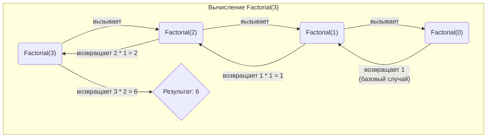

```pascal
program RecursionExample;

// Рекурсивная функция вычисления факториала
function Factorial(N: Integer): LongInt;
begin
  // Условие выхода (базовый случай)
  if N <= 0 then
    Result := 1
  // Рекурсивный шаг
  else
    Result := N * Factorial(N - 1);
end;

// Для сравнения - итеративная реализация
function Factorial_Iterative(N: Integer): LongInt;
var
  i: Integer;
begin
  Result := 1;
  for i := 1 to N do
    Result := Result * i;
  if N < 0 then Result := 0;
end;

begin
  WriteLn('Рекурсивный факториал 5! = ', Factorial(5));
  WriteLn('Итеративный факториал 5! = ', Factorial_Iterative(5));
  ReadLn;
end.
```
Рекурсивность — это не свойство задачи, а особенность ее реализации. Практически любую рекурсивную программу можно переписать с использованием циклов (итеративно).

---

# 9. Директивы подпрограмм. Неявная рекурсия. Пример.

**Директивы подпрограмм** — это специальные ключевые слова, которые следуют за заголовком подпрограммы и изменяют способ ее компиляции или вызова.

### Основные директивы

**1. `forward`**
**Назначение:** Позволяет сделать **опережающее объявление** подпрограммы. Это необходимо, когда нужно вызвать подпрограмму до того, как она будет полностью определена в коде. Типичный случай использования — организация взаимной (неявной) рекурсии.

**Описание:**
*   **Опережающее описание:** Содержит полный заголовок подпрограммы, за которым следует директива `forward`.
*   **Определяющее описание:** Появляется позже в коде. Оно может содержать сокращенный заголовок (без списка параметров) и обязательно включает тело подпрограммы.

**2. `inline`**
**Назначение:** Рекомендует компилятору не выполнять стандартный вызов подпрограммы, а вставлять ее машинный код **непосредственно в место вызова**.
*   **Преимущество:** Устраняются накладные расходы на вызов функции, что может ускорить выполнение кода.
*   **Недостаток:** Увеличивается размер исполняемого файла. Имеет смысл только для очень маленьких и часто вызываемых подпрограмм.

```pascal
function Min(X, Y: Integer): Integer; inline;
begin
  if X < Y then Result := X else Result := Y;
end;
```

**3. `external`**
**Назначение:** Объявляет подпрограмму, реализация которой находится во внешнем скомпилированном файле (например, в DLL — динамически подключаемой библиотеке).
```pascal
procedure MyExternalProc; stdcall; external 'MyLib.dll';
```

### Неявная (взаимная) рекурсия

**Неявная рекурсия** возникает, когда две или более подпрограммы вызывают друг друга по цепочке. Например, процедура `A` вызывает процедуру `B`, а процедура `B` вызывает процедуру `A`.

Проблема при реализации заключается в том, что в Pascal нельзя вызвать подпрограмму до ее объявления. Если `A` определяется раньше `B`, то `A` не может вызвать `B`. Если `B` определяется раньше, то `B` не может вызвать `A`.

Эта проблема решается с помощью директивы `forward`.

### Пример неявной рекурсии

Рассмотрим две процедуры, которые поочередно вызывают друг друга, уменьшая счетчик.

```pascal
program MutualRecursion;

// Опережающее объявление ProcedureB
procedure ProcedureB(Counter: Integer); forward;

// Полное определение ProcedureA
procedure ProcedureA(Counter: Integer);
begin
  WriteLn('Вызвана ProcedureA со счетчиком: ', Counter);
  if Counter > 0 then
    // ProcedureA вызывает ProcedureB
    ProcedureB(Counter - 1);
end;

// Определяющее описание ProcedureB
// Заголовок можно писать сокращенно: procedure ProcedureB;
procedure ProcedureB(Counter: Integer);
begin
  WriteLn('Вызвана ProcedureB со счетчиком: ', Counter);
  if Counter > 0 then
    // ProcedureB вызывает ProcedureA, создавая цикл
    ProcedureA(Counter - 1);
end;

begin
  // Запускаем цепочку вызовов
  ProcedureA(5);
  ReadLn;
end.
```
**Результат выполнения:**
```
Вызвана ProcedureA со счетчиком: 5
Вызвана ProcedureB со счетчиком: 4
Вызвана ProcedureA со счетчиком: 3
Вызвана ProcedureB со счетчиком: 2
Вызвана ProcedureA со счетчиком: 1
Вызвана ProcedureB со счетчиком: 0
```
---

# 10. Библиотечные модули пользователя. Назначение модуля. Структура модуля. Синтаксис и назначение разделов модуля. Пример.

**Библиотечный модуль (`unit`)** — это отдельно компилируемый файл (`.pas`), который содержит набор типов, констант, переменных, процедур и функций, предназначенных для многократного использования в различных программах.

**Назначение модуля:**
*   **Модульное программирование:** Разделение большой программы на логические, независимые части.
*   **Повторное использование кода:** Создание библиотек с общими функциями (например, для математических вычислений, работы со строками, файлами).
*   **Сокрытие реализации:** Модуль позволяет предоставить другим программистам только интерфейс для работы с функционалом, скрыв детали его внутренней реализации.
*   **Ускорение компиляции:** Модули компилируются в файлы `.dcu` (Delphi Compiled Unit). При внесении изменений в основной проект перекомпилируются только те модули, которые были затронуты.

### Структура модуля

Каждый модуль имеет строгую структуру, состоящую из нескольких разделов.

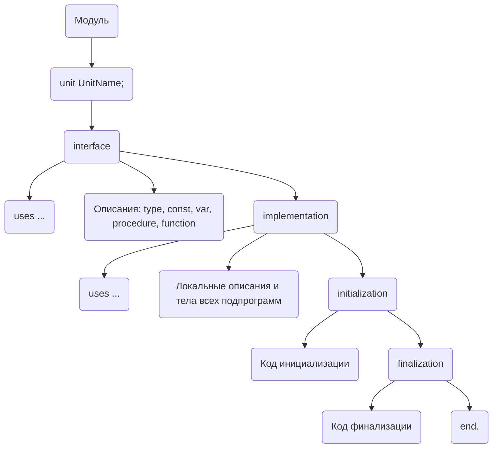

### Назначение разделов

1.  **`unit <Имя_модуля>;`** — Заголовок. Имя модуля должно совпадать с именем файла.

2.  **`interface` (интерфейсный раздел)**
    *   **Назначение:** "Публичная" часть модуля. Все, что здесь описано, будет видно и доступно другим модулям и основной программе, которые подключат этот `unit`.
    *   **Содержимое:** Заголовки глобальных процедур и функций, объявления публичных типов, констант и переменных.
    *   `uses`: Список модулей, которые необходимы для объявления элементов в секции `interface`.

3.  **`implementation` (раздел реализации)**
    *   **Назначение:** "Приватная" часть модуля. Здесь скрыта вся логика работы.
    *   **Содержимое:**
        *   Полные тела всех процедур и функций, объявленных в `interface`.
        *   Описание локальных (вспомогательных) типов, констант, переменных и подпрограмм, которые не видны извне.
    *   `uses`: Список модулей, необходимых только для кода в секции `implementation`.

4.  **`initialization` (раздел инициализации, необязательный)**
    *   **Назначение:** Содержит код, который выполнится **один раз** при загрузке модуля в память, до старта основного кода программы.
    *   **Применение:** Инициализация переменных, создание объектов, открытие файлов.

5.  **`finalization` (раздел финализации, необязательный)**
    *   **Назначение:** Содержит код, который выполнится **один раз** при выгрузке модуля из памяти, после завершения работы основной программы.
    *   **Применение:** Освобождение ресурсов, закрытие файлов, очистка памяти.

6.  **`end.`** — Обязательное слово, завершающее модуль.

### Пример

Создадим простой модуль `MathUtils.pas` с одной функцией.

**Файл `MathUtils.pas`:**
```pascal
unit MathUtils;

interface

// Публичная функция, доступная извне
function Power(Base: Real; Exponent: Integer): Real;

implementation

// Функция Power видна только здесь, но ее объявление было
// в интерфейсной части, поэтому тут мы пишем ее тело.
function Power(Base: Real; Exponent: Integer): Real;
var
  i: Integer;
begin
  Result := 1.0;
  if Exponent < 0 then
  begin
    Base := 1.0 / Base;
    Exponent := -Exponent;
  end;
  for i := 1 to Exponent do
    Result := Result * Base;
end;

initialization
  // Этот код выполнится один раз при запуске программы
  WriteLn('Модуль MathUtils загружен.');

finalization
  // Этот код выполнится при завершении программы
  WriteLn('Модуль MathUtils выгружен.');

end.
```

**Файл основной программы `MyProject.dpr`:**
```pascal
program MyProject;

uses
  SysUtils,
  MathUtils; // Подключаем наш модуль

var
  Res: Real;

begin
  Res := Power(2, 10); // Используем функцию из модуля
  WriteLn('2 в степени 10 = ', Res);
  ReadLn;
end.
```

# 11. Записи. Синтаксис задания. Записи без вариантной части. Операции над записями и над полями. Пример.

**Запись (record)** — это структурированный тип данных, состоящий из фиксированного числа упорядоченных компонентов разного типа. Эти компоненты называются **полями** записи. Другие названия — комбинированный или структурированный тип.

### Синтаксис задания

Запись объявляется в разделе `type` с помощью зарезервированных слов `record` и `end`.

```pascal
type
  <Имя_типа_записи> = record
    <Имя_поля_1>: <Тип_поля_1>;
    <Имя_поля_2>: <Тип_поля_2>;
    ...
  end;
```
Поля записи могут быть любого типа, в том числе и другой записью, что позволяет создавать иерархические структуры данных.

### Представление в памяти и доступ к полям

В памяти поля записи располагаются последовательно, одно за другим. Общий объем памяти, занимаемый переменной типа запись, равен сумме объемов памяти ее полей (с учетом выравнивания, если оно включено).

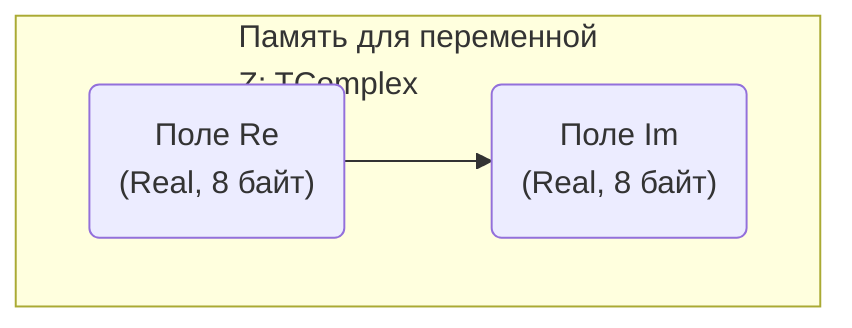

Доступ к полю осуществляется через **составное имя**, которое состоит из имени переменной-записи и имени поля, разделенных точкой.
`Имя_переменной.Имя_поля`

### Операции

*   **Над полями:** К каждому полю записи можно применять любые операции, допустимые для его типа данных. Например, с числовыми полями можно производить арифметические операции.
*   **Над записями в целом:** Для полных переменных типа запись определена только одна операция — **присваивание (`:=`)**. Можно присвоить одной переменной-записи значение другой переменной того же типа. При этом происходит поэлементное копирование всех полей.

### Пример

```pascal
program RecordExample;

type
  // Описание типа "комплексное число"
  TComplex = record
    Re: Real; // Действительная часть
    Im: Real; // Мнимая часть
  end;

var
  Z1, Z2: TComplex;
  Module: Real;

begin
  // Присваиваем значения полям записи Z1
  Z1.Re := 3.0;
  Z1.Im := 4.0;

  // Выполняем операции с полями
  Module := Sqrt(Sqr(Z1.Re) + Sqr(Z1.Im));
  WriteLn('Модуль числа Z1 = ', Module:0:2);

  // Применяем операцию присваивания для всей записи
  Z2 := Z1;

  WriteLn('Действительная часть Z2: ', Z2.Re);
  WriteLn('Мнимая часть Z2: ', Z2.Im);

  ReadLn;
end.
```
---

# 12. Записи с вариантами. Синтаксис задания. Особенности задания записей с полем признака и без него. Пример.

**Записи с вариантами** позволяют создавать структуры, которые могут содержать различные наборы полей в зависимости от некоторого условия. Это достигается за счет **вариантной части**, которая объявляется с помощью оператора `case`.

### Синтаксис задания

Вариантная часть должна следовать после всех общих (фиксированных) полей записи.
```pascal
type
  <Имя_типа> = record
    <Общие_поля>;
    case <Поле_признака>: <Тип_признака> of
      <Значение_1>: (<Поля_варианта_1>);
      <Значение_2>: (<Поля_варианта_2>);
      ...
  end;
```
*   **Поле признака (поле-тег):** Необязательное поле, которое определяет, какой из вариантов является активным в данный момент.
*   Важно: у оператора `case` внутри `record` нет своего `end`. Всю конструкцию `record` завершает один `end`.

### Особенности

*   **Общая область памяти:** Все поля всех вариантов занимают **одну и ту же область памяти**. Размер этой области определяется по **наибольшему** варианту. Это позволяет экономить память.

    ```mermaid
    graph TD
        subgraph "TFigure"
            direction TB
            Общая_часть("ShapeType: TShapeKind")
            Общая_часть --> Вариантная_часть("Вариантная часть (общая память)")
        end
        subgraph "Вариантная часть"
            direction LR
            Вариант_Прямоугольник("Width: Integer<br>Height: Integer")
            Вариант_Круг("Radius: Integer")
        end
        Вариант_Прямоугольник -.-> Вариантная_часть
        Вариант_Круг -.-> Вариантная_часть
        linkStyle 2,3 stroke-dasharray: 5 5;
    ```
*   **Отсутствие контроля:** Компилятор **не контролирует** доступ к полям вариантной части. Можно присвоить полю признака одно значение, а обращаться к полям другого варианта. Это мощный, но опасный механизм, который может привести к неверной интерпретации данных в памяти.
*   **Уникальность имен полей:** Имена всех полей, даже в разных вариантах, должны быть уникальны в пределах одной записи.
*   **Запись без поля признака:** Можно объявить вариантную часть без поля признака, указав только его тип (`case <Тип_признака> of ...`). Это, по сути, позволяет объединить несколько полей разных типов в одной области памяти (аналог `union` в языке C).

### Пример

```pascal
program VariantRecordExample;

type
  TShapeKind = (skRectangle, skCircle);

  TFigure = record
    X, Y: Integer; // Общие поля - координаты
    case Kind: TShapeKind of // Поле признака
      skRectangle: (Width, Height: Integer);
      skCircle: (Radius: Real);
  end;

var
  Fig: TFigure;

begin
  // --- Работаем с фигурой как с прямоугольником ---
  Fig.Kind := skRectangle;
  Fig.X := 10;
  Fig.Y := 20;
  Fig.Width := 100;
  Fig.Height := 50;
  WriteLn('Прямоугольник: Ширина = ', Fig.Width);

  // --- Теперь работаем с той же переменной как с кругом ---
  Fig.Kind := skCircle;
  Fig.X := 30; // Общие поля остаются доступными
  Fig.Radius := 25.5;
  WriteLn('Круг: Радиус = ', Fig.Radius:0:1);
  
  // Опасный доступ: поле Kind = skCircle, но мы читаем поле Width
  // В памяти на месте Width и Height теперь находится Radius (Real, 8 байт)
  // Результат будет непредсказуемым.
  WriteLn('Некорректный доступ к Width: ', Fig.Width);

  ReadLn;
end.
```
---

# 13. Оператор присоединения. Назначение. Формат. Полная и сокращенная формы оператора присоединения. Примеры использования.

**Оператор присоединения (`with ... do`)** — это синтаксическая конструкция, которая предоставляет сокращенный способ доступа к полям переменной типа `record`.

**Назначение:**
*   **Упрощение кода:** Избавляет от необходимости многократно писать имя переменной-записи при обращении к ее полям, делая код короче и читабельнее.
*   **Минимизация адресных вычислений:** Адрес переменной-записи вычисляется один раз перед входом в блок `with`, что может незначительно повысить производительность в сложных циклах.

### Формат

**Полная форма:**
```pascal
with <Имя_переменной_записи> do
begin
  // Внутри этого блока можно обращаться к полям напрямую
  <Поле_1> := <Значение_1>;
  <Поле_2> := <Значение_2>;
end;
```
Если нужно выполнить только один оператор, `begin` и `end` можно опустить.

**Сокращенная форма (для нескольких записей):**
Можно указать несколько переменных-записей через запятую.
```pascal
with <Запись_1>, <Запись_2>, ... do
  <Оператор>;
```
Это эквивалентно вложенным операторам `with`:
```pascal
with <Запись_1> do
  with <Запись_2> do
    ...
```
**Правило разрешения конфликтов:** Если у нескольких записей в списке `with` есть одноименные поля, то при обращении по короткому имени будет использовано поле той записи, которая указана в списке **правее (ближе к `do`)**. Чтобы обратиться к полю другой записи или одноименной глобальной переменной, нужно использовать ее полное имя.

### Пример

```pascal
program WithOperatorExample;

type
  TDate = record
    Day, Month, Year: Word;
  end;

  TPerson = record
    Name: string;
    BirthDate: TDate;
  end;

var
  Person: TPerson;
  Year: Word; // Глобальная переменная с тем же именем, что и поле

begin
  Year := 2023; // Инициализируем глобальную переменную

  // --- Без оператора with ---
  Person.Name := 'Иван Петров';
  Person.BirthDate.Day := 15;
  Person.BirthDate.Month := 5;
  Person.BirthDate.Year := 1990;

  WriteLn(Person.Name, ' родился ', Person.BirthDate.Day, '.', Person.BirthDate.Month, '.', Person.BirthDate.Year);

  // --- С оператором with ---
  with Person, BirthDate do // Сокращенная форма для Person и Person.BirthDate
  begin
    Name := 'Анна Сидорова'; // Поле записи Person
    Day := 20;               // Поле записи BirthDate
    Month := 10;             // Поле записи BirthDate
    Year := 2001;            // Поле записи BirthDate, а не глобальная переменная!

    WriteLn(Name, ' родилась ', Day, '.', Month, '.', Year);

    // Чтобы обратиться к глобальной переменной Year, нужно полное имя
    WriteLn('Текущий год (глобальная переменная): ', WithOperatorExample.Year);
  end;

  ReadLn;
end.
```
---
# 14. Множественный тип. Синтаксис задания. Базовый тип множества. Представление в памяти. Конструктор множества. Пример.

**Множественный тип (`set`)** — это тип данных, представляющий собой неупорядоченную совокупность (коллекцию) уникальных элементов одного и того же **базового типа**.

### Базовый тип

Базовым для множества может быть любой **порядковый тип** (целые числа, символы, перечисляемый тип), при условии, что количество его возможных значений не превышает **256**, а порядковые номера этих значений лежат в диапазоне от `0` до `255`. Вещественные типы не могут быть базовыми.

### Синтаксис задания
```pascal
type
  <Имя_типа> = set of <Базовый_тип>;
```
### Представление в памяти

Множество в памяти представляется в виде **битовой карты (bitmap)**. Для каждого возможного элемента базового типа выделяется один бит.
*   Если бит равен **1**, элемент **включен** во множество.
*   Если бит равен **0**, элемент **не включен** во множество.

Размер множества в памяти зависит от диапазона базового типа и составляет от 1 до 32 байт (256 бит).

```mermaid
graph TD
    subgraph "Память для 'set of 0..7' (1 байт)"
        direction LR
        B7("Бит 7") -- B6("Бит 6") -- B5("Бит 5") -- B4("Бит 4") -- B3("Бит 3") -- B2("Бит 2") -- B1("Бит 1") -- B0("Бит 0")
    end
    subgraph "Значение [0, 3, 4]"
        direction LR
        V7("0") -- V6("0") -- V5("0") -- V4("1") -- V3("1") -- V2("0") -- V1("0") -- V0("1")
    end
    B7 -- "соответствует элементу 7" --> V7
    B4 -- "соответствует элементу 4" --> V4
    B3 -- "соответствует элементу 3" --> V3
    B0 -- "соответствует элементу 0" --> V0
```

### Конструктор множества

**Конструктор множества** — это способ задания конкретного значения (литерала) множественного типа. Он представляет собой список элементов или диапазонов, разделенных запятыми и заключенных в квадратные скобки `[]`.

*   `[]` — пустое множество.
*   `[1, 3, 5]` — множество, содержащее элементы 1, 3, 5.
*   `['a'..'z']` — множество, содержащее все строчные латинские буквы.
*   `[1..5, 10]` — множество, содержащее элементы 1, 2, 3, 4, 5, 10.

### Пример

```pascal
program SetExample;

type
  // Базовый перечисляемый тип
  TDay = (dMon, dTue, dWed, dThu, dFri, dSat, dSun);
  // Множественный тип на его основе
  TDaysSet = set of TDay;

var
  WorkDays: TDaysSet;
  Weekend: TDaysSet;
  Today: TDay;

begin
  // Используем конструкторы для инициализации множеств
  WorkDays := [dMon..dFri];
  Weekend := [dSat, dSun];
  
  Today := dTue;
  
  // Проверяем принадлежность элемента множеству
  if Today in WorkDays then
    WriteLn('Вторник - рабочий день.')
  else
    WriteLn('Вторник - выходной.');

  Today := dSun;
  if Today in Weekend then
    WriteLn('Воскресенье - выходной день.');

  // Объединение множеств
  WriteLn('Количество элементов во множестве WorkDays: ', SizeOf(WorkDays) * 8); // Иллюстрация размера

  ReadLn;
end.
```
---

# 15. Множественные выражения. Операции и встроенные функции над множествами. Ввод-вывод множественных переменных. Пример.

**Множественное выражение** — это выражение, результатом которого является значение множественного типа. Частными случаями являются переменные и константы множественного типа, а также конструкторы множеств.

### Операции над множествами

Pascal предоставляет богатый набор операций для работы с множествами, аналогичных операциям в математической теории множеств.

| Операция | Название                    | Описание                                                     | Тип результата |
| :------: | :-------------------------- | :----------------------------------------------------------- | :------------- |
| `+`      | Объединение                 | Создает множество, содержащее элементы из обоих операндов.   | `set`          |
| `*`      | Пересечение                 | Создает множество, содержащее только общие элементы операндов. | `set`          |
| `-`      | Разность                    | Создает множество, содержащее элементы первого операнда, которых нет во втором. | `set`          |
| `=`      | Равенство                   | Возвращает `True`, если множества содержат одинаковые элементы. | `Boolean`      |
| `<>`     | Неравенство                 | Возвращает `True`, если множества различаются.              | `Boolean`      |
| `<=`     | Включение (подмножество)    | Возвращает `True`, если все элементы первого множества есть во втором. | `Boolean`      |
| `>=`     | Включение (надмножество)    | Возвращает `True`, если все элементы второго множества есть в первом. | `Boolean`      |
| `in`     | Проверка принадлежности     | Возвращает `True`, если элемент (левый операнд) содержится во множестве (правый операнд). | `Boolean`      |

### Встроенные функции и процедуры
*   `Include(S, E)`: Добавляет элемент `E` в множество `S`. Эффективнее, чем `S := S + [E]`.
*   `Exclude(S, E)`: Удаляет элемент `E` из множества `S`. Эффективнее, чем `S := S - [E]`.
*   `SizeOf(S)`: Возвращает количество **байт**, занимаемых множеством `S` в памяти.

### Ввод-вывод множественных переменных

В языке Pascal **нет** встроенных средств для прямого ввода или вывода множества целиком (`ReadLn(MySet)` или `WriteLn(MySet)` не работают). Ввод и вывод необходимо организовывать **поэлементно**, перебирая все возможные значения базового типа и проверяя их принадлежность множеству с помощью оператора `in`.

### Пример

```pascal
program SetOperations;

type
  DigitsSet = set of 0..9;

var
  Set1, Set2, Union, Intersection, Difference: DigitsSet;
  i: Byte;

begin
  // Инициализация
  Set1 := [1, 2, 3, 4, 5];
  Set2 := [4, 5, 6, 7, 8];

  // Операции
  Union := Set1 + Set2;        // [1, 2, 3, 4, 5, 6, 7, 8]
  Intersection := Set1 * Set2;  // [4, 5]
  Difference := Set1 - Set2;    // [1, 2, 3]

  // --- Организация вывода ---
  Write('Set1: ');
  for i := 0 to 9 do
    if i in Set1 then Write(i, ' ');
  WriteLn;

  Write('Set2: ');
  for i := 0 to 9 do
    if i in Set2 then Write(i, ' ');
  WriteLn;

  Write('Объединение: ');
  for i := 0 to 9 do
    if i in Union then Write(i, ' ');
  WriteLn;

  Write('Пересечение: ');
  for i := 0 to 9 do
    if i in Intersection then Write(i, ' ');
  WriteLn;
  
  if [4, 5] <= Set1 then
    WriteLn('Множество [4, 5] является подмножеством Set1');

  ReadLn;
end.
```
---

# 16. Типизованные константы-записи (с вариантами и без) и константы-множества. Назначение. Синтаксис задания. Примеры использования.

**Типизованная константа** — это конструкция, которая объявляется в разделе `const`, но, в отличие от обычной константы, ей можно присваивать новое значение во время выполнения программы (если включена опция компилятора `{$J+}` или `{$WRITABLECONST ON}`). По сути, это **инициализированная переменная**.

**Назначение:** Основное назначение таких констант — присваивание начальных значений сложным структурам данных (записям и множествам) на этапе их объявления.

### Константа-запись

**Синтаксис:**
После имени и типа константы в круглых скобках перечисляются имена полей и их начальные значения, разделенные точкой с запятой.
```pascal
const
  <Имя_константы>: <Тип_записи> = (<Поле1>: <Значение1>; <Поле2>: <Значение2>; ...);
```
**Особенности:**
*   Поля должны инициализироваться в том же порядке, в котором они объявлены в типе.
*   **Для записей с вариантами:** нужно задавать значения полей только для **одного** из вариантов. Если есть поле признака, его значение должно соответствовать выбранному варианту.

### Константа-множество

**Синтаксис:**
Используется обычный конструктор множества.
```pascal
const
  <Имя_константы>: <Тип_множества> = [<Список_элементов_и_диапазонов>];
```

### Примеры использования

```pascal
program TypedConstsExample;

// --- Типы для записей ---
type
  TPoint = record
    X, Y: Integer;
  end;

  TShapeKind = (skRectangle, skCircle);
  TFigure = record
    case Kind: TShapeKind of
      skRectangle: (Width, Height: Integer);
      skCircle: (Radius: Real);
  end;
// --- Тип для множества ---
  TLatinChars = set of 'a'..'z';

// --- Объявление типизованных констант ---
const
  // Константа-запись без вариантов
  OriginPoint: TPoint = (X: 0; Y: 0);

  // Константа-запись с вариантами
  DefaultRect: TFigure = (Kind: skRectangle; Width: 100; Height: 50);

  // Константа-множество
  Vowels: TLatinChars = ['a', 'e', 'i', 'o', 'u'];

var
  MyPoint: TPoint;
  Figure: TFigure;
  MyChar: Char;

begin
  // Использование констант для инициализации переменных
  MyPoint := OriginPoint;
  Figure := DefaultRect;

  WriteLn('Координаты точки: (', MyPoint.X, ', ', MyPoint.Y, ')');
  WriteLn('Ширина фигуры: ', Figure.Width);

  // Использование константы-множества в условии
  MyChar := 'a';
  if MyChar in Vowels then
    WriteLn(MyChar, ' - гласная буква.');
  
  ReadLn;
end.
```
---

# 17. Файлы. Логический и физический файл. Способы доступа к элементам файла. Типы файлов. Синтаксис задания. Пример.

**Файл** в программировании — это именованная область данных на внешнем носителе (например, на жестком диске). Необходимо различать два понятия:

*   **Физический файл:** Реальный набор данных на диске, который видит пользователь и операционная система (например, `document.txt`).
*   **Логический файл (файловая переменная):** Представление физического файла внутри программы. Это переменная специального файлового типа, через которую осуществляются все операции с файлом.

### Способы доступа

1.  **Последовательный доступ (Sequential Access):** Доступ к элементам файла осуществляется строго по порядку, один за другим, начиная с самого первого. Чтобы прочитать N-й элемент, необходимо сначала прочитать все предыдущие N-1 элементов. Этот способ является основным для **текстовых файлов**.
2.  **Прямой доступ (Direct/Random Access):** Позволяет обратиться к любому элементу файла напрямую по его номеру (индексу), минуя все предыдущие. Этот способ характерен для **файлов с типом** и **файлов без типа**.

### Типы файлов в Pascal

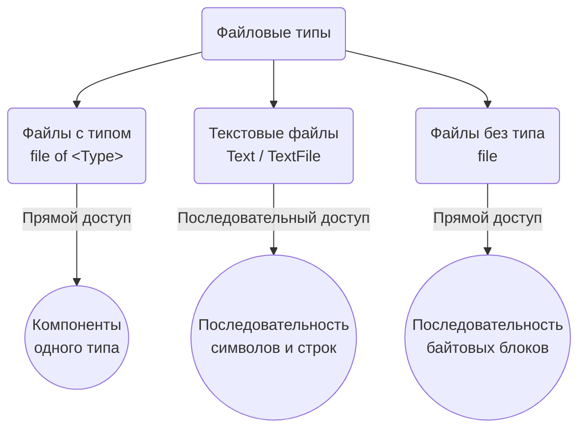

1.  **Файлы с типом (Typed Files):** Состоят из компонентов одного, строго определенного типа (например, `Integer`, `Real` или `record`).
    *   **Синтаксис:** `file of <Имя_типа>;`

2.  **Текстовые файлы (Text Files):** Состоят из символов, организованных в строки. Каждая строка завершается специальным маркером конца строки (CR/LF).
    *   **Синтаксис:** `Text` или `TextFile` (синонимы).

3.  **Файлы без типа (Untyped Files):** Рассматриваются как непрерывная последовательность байт, сгруппированных в блоки фиксированного размера. Используются для высокоскоростного низкоуровневого ввода-вывода.
    *   **Синтаксис:** `file`

**Указатель файла:** С каждой файловой переменной связан внутренний **указатель**, который определяет текущую позицию в файле для следующей операции чтения или записи.

### Пример синтаксиса

```pascal
program FileTypesSyntax;

type
  TEmployee = record
    ID: Integer;
    Name: string[50];
  end;

var
  // 1. Файловая переменная для файла с типом
  EmployeeFile: file of TEmployee;

  // 2. Файловая переменная для текстового файла
  LogFile: TextFile;

  // 3. Файловая переменная для файла без типа
  RawDataFile: file;

begin
  // Этот пример только демонстрирует синтаксис объявления.
  // Никакие операции с файлами здесь не производятся.
  WriteLn('Пример объявления файловых переменных.');
  ReadLn;
end.
```
---
# 18. Процедура Assign/AssignFile. Назначение. Формат. Абсолютные и относительные пути к файлам. Логические имена устройств ввода-вывода. Пример.

Процедура `Assign` (или ее синоним `AssignFile`, который является предпочтительным) играет ключевую роль в работе с файлами.

**Назначение:** Устанавливает связь (ассоциацию) между **логическим файлом** (файловой переменной в программе) и **физическим файлом** на диске или логическим устройством. Эта процедура **всегда должна вызываться перед** любыми операциями открытия файла (`Reset`, `Rewrite`, `Append`).

### Формат
```pascal
procedure AssignFile(var F; Name: String);
```
*   `F`: Файловая переменная любого файлового типа (`TextFile`, `file of <Type>`, `file`).
*   `Name`: Выражение строкового типа, содержащее имя файла или логического устройства.

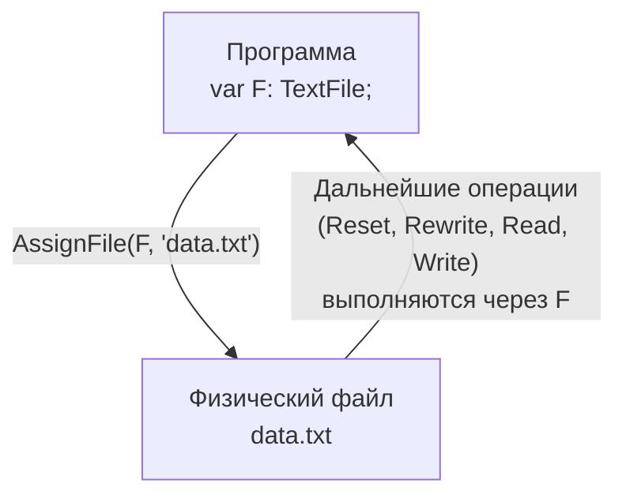
### Абсолютные и относительные пути

Параметр `Name` может задавать путь к файлу двумя способами:
1.  **Абсолютный путь:** Полный путь к файлу от корневого каталога диска (например, `C:\Users\Student\Documents\report.txt`). Такой путь однозначно определяет местоположение файла в системе.
2.  **Относительный путь:** Путь к файлу относительно **текущего рабочего каталога** программы (например, `report.txt` или `data\input.dat`). Если указано только имя файла, он будет искаться или создаваться в том же каталоге, где находится исполняемый `.exe` файл программы.

### Логические имена устройств ввода-вывода

В качестве параметра `Name` можно указывать не только пути к файлам, но и стандартные логические имена устройств. Это позволяет перенаправить ввод/вывод на стандартные устройства.
*   **`CON`**: Устройство консоли (ввод с клавиатуры, вывод на экран). Стандартные файлы `Input` и `Output` по умолчанию связаны с `CON`.
*   **`PRN`**, **`LPT1`**, `LPT2`, `LPT3`: Устройства печати (принтеры).
*   **`NUL`**: "Нулевое" устройство. Запись в него игнорируется, а чтение из него немедленно возвращает признак конца файла. Полезно для тестирования.
*   **`''` (пустая строка)**: Синоним для `CON`. `AssignFile(F, '')` связывает файл с консолью.

### Пример
```pascal
program AssignExample;

var
  MyFile: TextFile;
  s: string;

begin
  // 1. Связываем файловую переменную с файлом 'output.txt' в текущем каталоге
  AssignFile(MyFile, 'output.txt');
  // Открываем файл для записи. Если он существует, он будет перезаписан.
  Rewrite(MyFile);
  // Записываем строку в файл
  WriteLn(MyFile, 'Это строка будет в файле.');
  // Обязательно закрываем файл
  CloseFile(MyFile);
  WriteLn('Данные записаны в output.txt');

  // 2. Связываем ту же переменную с консолью
  AssignFile(MyFile, ''); // или 'CON'
  // Открываем для записи (в данном случае, для вывода на экран)
  Rewrite(MyFile);
  Write(MyFile, 'Эта строка будет выведена на консоль. Введите ответ: ');
  // Для чтения с консоли нужно было бы открыть через Reset
  ReadLn(s); // Читаем с клавиатуры
  WriteLn(MyFile, 'Вы ввели: ', s);
  CloseFile(MyFile);

  ReadLn;
end.
```
---
# 19. Файлы с типом. Синтаксис задания. Процедуры открытия, чтения и записи, определенные над файлами с типом. Пример.

**Файл с типом (Typed File)** — это файл, который рассматривается как последовательность компонентов одного и того же, строго определенного типа. Этот тип может быть любым (кроме файлового), например, `Integer`, `Real`, `string` или `record`.

**Назначение:** Идеально подходят для хранения структурированных данных (баз данных, настроек), так как не требуют преобразования типов при чтении/записи и поддерживают прямой доступ к элементам.

### Синтаксис задания
```pascal
type
  <Тип_компонента> = ...;
var
  <Имя_файловой_переменной>: file of <Тип_компонента>;
```
### Процедуры для работы
После того как файловая переменная связана с физическим файлом через `AssignFile`, для работы с ней используются следующие процедуры:

1.  **Открытие файла:**
    *   `Rewrite(F)`: Создает **новый пустой файл** для записи. Если файл с таким именем уже существует, его содержимое **полностью стирается**. Устанавливает указатель файла на начало (позиция 0).
    *   `Reset(F)`: Открывает **существующий файл**. Если файл не найден, возникнет ошибка ввода-вывода. Устанавливает указатель файла на начало (позиция 0).

    **Важная особенность:** В отличие от текстовых файлов, после открытия файла с типом любой из этих процедур он доступен **одновременно и для чтения, и для записи**.

2.  **Чтение и запись:**
    *   `Read(F, V1, V2, ...)`: Считывает один или несколько компонентов из файла (начиная с текущей позиции указателя) в переменные `V1`, `V2`, ... . Тип этих переменных должен быть таким же, как базовый тип файла. После чтения каждого компонента указатель файла сдвигается на следующий компонент.
    *   `Write(F, V1, V2, ...)`: Записывает значения из переменных `V1`, `V2`, ... в файл (начиная с текущей позиции указателя). После записи каждого компонента указатель сдвигается.

3.  **Закрытие файла:**
    *   `CloseFile(F)`: Завершает работу с файлом. Эта процедура обязательна. Она обеспечивает запись всех буферизированных данных на диск и освобождает системные ресурсы, связанные с файлом.

### Пример
В этом примере создается файл, содержащий несколько записей о студентах, а затем он читается и его содержимое выводится на экран.
```pascal
program TypedFileExample;

type
  TStudent = record
    ID: Integer;
    Name: String[40];
    AvgGrade: Real;
  end;

var
  StudentsFile: file of TStudent;
  Student: TStudent;
  i: Integer;

begin
  AssignFile(StudentsFile, 'students.dat');

  // --- Запись данных в файл ---
  Rewrite(StudentsFile); // Создаем новый файл
  for i := 1 to 3 do
  begin
    Student.ID := i;
    Student.Name := 'Студент ' + IntToStr(i);
    Student.AvgGrade := Random * 5;
    Write(StudentsFile, Student); // Записываем одну запись в файл
  end;
  WriteLn('Данные о 3 студентах записаны в файл.');
  CloseFile(StudentsFile); // Закрываем файл после записи

  // --- Чтение данных из файла ---
  Reset(StudentsFile); // Открываем существующий файл для чтения
  WriteLn('Содержимое файла students.dat:');
  while not Eof(StudentsFile) do // Читаем до конца файла
  begin
    Read(StudentsFile, Student); // Читаем одну запись
    WriteLn('ID: ', Student.ID, ', Имя: ', Student.Name, ', Средний балл: ', Student.AvgGrade:0:2);
  end;
  CloseFile(StudentsFile); // Закрываем файл после чтения

  ReadLn;
end.
```
---
# 20. Организация прямого доступа к элементам файлов с типом. Встроенные функции, определенные над файлами с типом. Закрытие файлов с типом. Примеры.

**Прямой доступ** — это ключевое преимущество файлов с типом, позволяющее читать, записывать или позиционироваться на любой компонент файла напрямую по его номеру (индексу), а не последовательно. Нумерация компонентов начинается с **0**.

### Процедуры и функции для прямого доступа

1.  `Seek(F, N)`
    *   **Тип:** Процедура.
    *   **Назначение:** Перемещает **указатель файла** `F` на компонент с номером `N`. `N` — это выражение типа `LongInt`. После вызова `Seek(F, N)` следующая операция `Read` или `Write` будет выполнена над N-м компонентом.
    *   `Seek(F, 0)` перемещает указатель в начало файла.
    *   `Seek(F, FileSize(F))` перемещает указатель в конец файла для добавления новых данных.

2.  `FileSize(F)`
    *   **Тип:** Функция, возвращает `LongInt`.
    *   **Назначение:** Возвращает **общее количество компонентов** в файле `F`. Если файл пуст, возвращает 0.

3.  `FilePos(F)`
    *   **Тип:** Функция, возвращает `LongInt`.
    *   **Назначение:** Возвращает **номер (индекс) текущего компонента**, на который указывает файловый указатель. В начале файла возвращает 0.

### Прочие важные функции

*   `Eof(F)`: (End Of File) Функция, возвращает `Boolean`. `True`, если указатель файла находится за последним компонентом, иначе `False`.
*   `CloseFile(F)`: Процедура. **Обязательна** для завершения работы с файлом. Гарантирует, что все данные из буфера операционной системы будут физически записаны на диск, и освобождает связанные с файлом ресурсы.

### Пример
Пример демонстрирует чтение, модификацию конкретной записи и добавление новой записи в конец файла с использованием прямого доступа.
```pascal
program DirectAccessExample;

type
  TData = record
    Code: Integer;
    Value: string[20];
  end;

var
  F: file of TData;
  DataRec: TData;
  RecNumber: LongInt;

begin
  AssignFile(F, 'data_direct.dat');

  // 1. Создание и заполнение файла
  Rewrite(F);
  for RecNumber := 0 to 4 do begin
    DataRec.Code := RecNumber * 10;
    DataRec.Value := 'Запись номер ' + IntToStr(RecNumber);
    Write(F, DataRec);
  end;
  WriteLn('Файл создан. Всего записей: ', FileSize(F));

  // 2. Чтение и модификация 3-й записи (индекс 2)
  RecNumber := 2;
  Seek(F, RecNumber); // Переходим к записи №2
  Read(F, DataRec);   // Читаем ее
  WriteLn('Прочитана запись ', FilePos(F)-1, ': ', DataRec.Value);
  
  DataRec.Value := '--- МОДИФИЦИРОВАНО ---'; // Изменяем данные в памяти
  Seek(F, RecNumber); // Снова позиционируемся на то же место
  Write(F, DataRec);  // и перезаписываем запись в файле
  WriteLn('Запись ', RecNumber, ' была модифицирована.');

  // 3. Добавление новой записи в конец файла
  Seek(F, FileSize(F)); // Переходим в конец файла
  DataRec.Code := 999;
  DataRec.Value := 'Новая последняя запись';
  Write(F, DataRec);
  WriteLn('В конец файла добавлена запись. Всего записей: ', FileSize(F));

  CloseFile(F);
  ReadLn;
end.
```
---

# 21. Текстовые файлы. Синтаксис задания. Процедуры и функции, обеспечивающие чтение из текстовых файлов, и их особенности по сравнению с файлами с типом. Допустимые типы вводимых переменных. Пример.

**Текстовый файл** — это файл, который интерпретируется как последовательность символов, сгруппированных в строки. Каждая строка завершается специальным маркером конца строки (в Windows это пара символов CR+LF: #13#10).

**Главное отличие от `file of Char`:** текстовый файл имеет структуру строк и поддерживает специальные процедуры для их обработки (`ReadLn`, `WriteLn`).

### Синтаксис задания
```pascal
var
  <Имя_файловой_переменной>: Text; // или TextFile (синонимы)
```
### Процедуры и функции для чтения

1.  `Reset(F)`
    *   **Особенность:** Открывает текстовый файл в режиме **только для чтения (read-only)**. Попытка записи в файл, открытый через `Reset`, вызовет ошибку.

2.  `Read(F, V1, V2, ...)`
    *   **Особенность:** Считывает данные из файла и **автоматически преобразует** их из текстового представления в тип соответствующей переменной (`V1`, `V2`, ...).
    *   При чтении чисел `Read` пропускает предшествующие пробелы и символы конца строки. Чтение прекращается на первом символе, который не может быть частью числа.
    *   При чтении строки `Read` считывает символы до пробела, таба или конца строки.

3.  `ReadLn(F, V1, V2, ...)`
    *   **Особенность:** Сначала работает так же, как `Read`, считывая значения для `V1, V2, ...`. После этого **перемещает файловый указатель на начало следующей строки**, пропуская все оставшиеся символы в текущей строке.
    *   Вызов `ReadLn(F)` без параметров просто перемещает указатель на следующую строку.

### Допустимые типы вводимых переменных
Процедуры `Read` и `ReadLn` могут считывать данные в переменные следующих типов:
*   Символьные (`Char` и его поддиапазоны).
*   Строковые (`String`, `AnsiString`, `ShortString`).
*   Целочисленные ( `Integer`, `Word`, `LongInt` и др.).
*   Вещественные (`Real`, `Double`, `Extended`).

### Пример
Предположим, есть файл `data.txt` со следующим содержимым:
```
John Smith
25 85.5
```
Программа для чтения этого файла:
```pascal
program ReadTextFile;

var
  F: TextFile;
  Name: string;
  Age: Integer;
  Score: Real;

begin
  AssignFile(F, 'data.txt');

  // Проверяем, существует ли файл
  {$I-} // Отключаем стандартную обработку ошибок ввода-вывода
  Reset(F);
  {$I+}
  if IOResult <> 0 then
  begin
    WriteLn('Файл data.txt не найден!');
    ReadLn;
    Halt; // Завершаем программу
  end;

  // Читаем первую строку целиком (имя)
  ReadLn(F, Name);
  // Читаем из второй строки возраст и балл
  ReadLn(F, Age, Score);

  CloseFile(F);

  WriteLn('Имя: ', Name);
  WriteLn('Возраст: ', Age);
  WriteLn('Балл: ', Score:0:1);

  ReadLn;
end.
```
---

# 22. Процедуры и функции, обеспечивающие запись в текстовые файлы, и их особенности по сравнению с файлами с типом. Допустимые типы выводимых переменных. Размещение информации в строке по умолчанию. Управление размещением информации по позициям строки. Пример.

### Процедуры для записи в текстовые файлы

1.  `Rewrite(F)`
    *   **Особенность:** Создает новый пустой файл и открывает его в режиме **только для записи (write-only)**. Если файл существовал, его содержимое уничтожается.

2.  `Append(F)`
    *   **Особенность:** Открывает **существующий** текстовый файл и устанавливает файловый указатель в его конец для **дозаписи**. Если файл не существует, возникает ошибка. Открывает файл в режиме **только для записи**. `Append` определена только для текстовых файлов.

3.  `Write(F, E1, E2, ...)`
    *   **Особенность:** **Автоматически преобразует** значения выражений `E1, E2, ...` в их текстовое представление и записывает в файл.

4.  `WriteLn(F, E1, E2, ...)`
    *   **Особенность:** Сначала работает как `Write`, а затем дописывает в файл **маркер конца строки**, осуществляя переход на новую строку. Вызов `WriteLn(F)` без параметров просто добавляет в файл новую строку.

### Допустимые типы выводимых переменных
В качестве выражений для `Write` и `WriteLn` могут выступать данные следующих типов:
*   Символьные, строковые, целочисленные, вещественные (аналогично чтению).
*   **Логические (`Boolean`)**: в файл записывается строка `'TRUE'` или `'FALSE'`.

### Управление размещением информации (форматирование)

По умолчанию `Write` записывает значения вплотную друг к другу. Для управления шириной поля вывода используются **спецификаторы форматирования**, которые указываются после выражения через двоеточие.

`Write(F, Expression:Width)`
*   `Width`: Целое число, задающее **минимальную ширину поля** для вывода. Если текстовое представление значения короче, оно будет дополнено пробелами **слева**. Если длиннее, поле будет расширено до нужного размера.

`Write(F, RealExpression:Width:Decimals)`
*   `Decimals`: Для вещественных чисел второй параметр задает **количество знаков после запятой**. Вывод будет осуществлен в формате с фиксированной точкой.

### Пример

```pascal
program WriteTextFile;

var
  F: TextFile;
  ProductName: string;
  Quantity: Integer;
  Price: Real;

begin
  AssignFile(F, 'receipt.txt');
  Rewrite(F); // Создаем новый файл

  // Заголовок чека
  WriteLn(F, '--------------------------------');
  WriteLn(F, '|      Товарный чек          |');
  WriteLn(F, '--------------------------------');

  // --- Вывод без форматирования ---
  ProductName := 'Молоко'; Quantity := 2; Price := 55.5;
  WriteLn(F, ProductName, Quantity, Price); // Вывод: Молоко2 5.5500000000E+001
  
  // --- Вывод с форматированием ---
  ProductName := 'Хлеб'; Quantity := 1; Price := 30.0;
  //          |Поле 15 симв.|Поле 5|Поле 10, 2 знака|
  WriteLn(F, ProductName:15, Quantity:5, Price:10:2);

  ProductName := 'Сыр "Российский"'; Quantity := 1; Price := 250.75;
  WriteLn(F, ProductName:15, Quantity:5, Price:10:2);

  WriteLn(F, '--------------------------------');
  
  // Дозапись в файл
  CloseFile(F);
  Append(F); // Открываем для дозаписи
  WriteLn(F, 'Итог будет подсчитан позже.');
  CloseFile(F);

  WriteLn('Файл receipt.txt успешно создан и дополнен.');
  ReadLn;
end.
```
**Содержимое файла `receipt.txt` после выполнения:**
```
--------------------------------
|      Товарный чек          |
--------------------------------
Молоко2 5.5500000000E+001
           Хлеб    1     30.00
Сыр "Российский"    1    250.75
--------------------------------
Итог будет подсчитан позже.
```

# 23. Процедуры, управляющие работой буфера ввода-вывода для текстовых файлов. Пример.

**Буфер ввода-вывода** — это специальный участок оперативной памяти, который используется для временного хранения данных при обмене информацией между программой и внешним файлом.

**Принцип работы:**
*   **При записи (`Write`/`WriteLn`):** Данные сначала поступают в буфер. Когда буфер заполняется, его содержимое единым блоком физически записывается на диск.
*   **При чтении (`Read`/`ReadLn`):** Из файла считывается сразу большой блок данных, который заполняет буфер. Последующие операции чтения берут данные из этого буфера в памяти, а не обращаются каждый раз к медленному диску.

Использование буфера значительно **повышает скорость** файловых операций, так как сокращает количество медленных обращений к физическому устройству. Каждому открытому файлу назначается свой буфер (по умолчанию размером 128 байт).

### Процедуры управления буфером

В Pascal есть две основные процедуры для управления буфером текстового файла. Они используются довольно редко, в основном в задачах, где требуется тонкий контроль над вводом-выводом.

1.  **`SetTextBuf(F, Buf [, Size])`**
    *   **Назначение:** Позволяет назначить файловой переменной `F` **пользовательский буфер** `Buf` заданного размера `Size`.
    *   **Параметры:**
        *   `F`: Файловая переменная типа `TextFile`.
        *   `Buf`: Любая переменная достаточного размера (например, массив байт или символов), которая будет использоваться как буфер.
        *   `Size` (необязательный): Выражение типа `Word`, задающее размер буфера в байтах. Если опущен, размер берется равным `SizeOf(Buf)`.
    *   **Ограничения:** Процедура должна вызываться **после** `AssignFile` и **до** `Reset`/`Rewrite`/`Append`. Нельзя применять к уже открытому файлу. Использование буфера большего размера (например, несколько килобайт) может ускорить работу с очень большими файлами.

2.  **`Flush(F)`**
    *   **Назначение:** Принудительно "сбрасывает" (очищает) буфер вывода, записывая все его текущее содержимое в физический файл, независимо от того, заполнен буфер или нет.
    *   **Применение:** Используется, когда необходимо гарантировать, что критически важные данные немедленно попали на диск, не дожидаясь автоматической очистки буфера (например, в лог-файлах перед возможным аварийным завершением программы).
    *   `CloseFile` автоматически выполняет `Flush` перед закрытием файла.

### Пример

```pascal
program BufferControlExample;

var
  F: TextFile;
  // Объявляем пользовательский буфер размером 4 КБ
  MyBuffer: array[1..4096] of Char;
  i: Integer;

begin
  AssignFile(F, 'buffered_log.txt');
  
  // Назначаем наш буфер файлу F
  SetTextBuf(F, MyBuffer);
  
  Rewrite(F);
  
  for i := 1 to 100 do
  begin
    WriteLn(F, 'Запись номер ', i);
    // После каждой 10-й записи принудительно сбрасываем буфер на диск
    if (i mod 10) = 0 then
    begin
      WriteLn('Сброс буфера на диск...');
      Flush(F); // Гарантируем, что данные физически записаны
    end;
  end;
  
  CloseFile(F); // CloseFile также выполнит Flush
  WriteLn('Работа с файлом завершена.');
  ReadLn;
end.
```
---
# 24. Сравнительная характеристика внутренней структуры представления информации в текстовом файле и файле с типом. Достоинства и недостатки использования текстового файла и файла с типом.

### Внутренняя структура представления

Основное различие заключается в том, как в файлах хранится информация, особенно числовая.

**1. Представление числовой информации (например, числа `123`)**

*   **Файл с типом (`file of Integer`)**:
    *   Число хранится в **двоичном формате**, так же, как оно представлено в оперативной памяти. `Integer` занимает 2 или 4 байта.
    *   Представление компактное, разделители между числами отсутствуют.
    *   Пример для 4-байтного `Integer`: `7B 00 00 00` (в hex).
    *   **Нечитаем** для человека в обычном текстовом редакторе.

*   **Текстовый файл (`TextFile`)**:
    *   Число преобразуется в **последовательность символов**. Каждая цифра кодируется своим ASCII/Unicode кодом.
    *   Для числа `123` потребуется 3 байта (`'1'`, `'2'`, `'3'`) плюс байты для разделителей (пробел, конец строки).
    *   Представление менее компактное, но **читаемо** для человека.

**2. Представление текстовой информации (например, строки)**

*   **Файл с типом (`file of String[20]`)**:
    *   Каждая строка занимает **фиксированный объем памяти**, равный максимальной длине строки (в данном случае `1 + 20 = 21` байт для `ShortString`).
    *   Если реальная длина строки меньше, оставшееся место не используется или заполняется мусором.
    *   Структура файла регулярна, что позволяет легко вычислить позицию любой строки.

*   **Текстовый файл (`TextFile`)**:
    *   Строки имеют **переменную длину**.
    *   Память занимают только сами символы строки плюс маркер конца строки (#13#10).
    *   Это более экономно для хранения текста с разной длиной строк.

### Сравнительная таблица

| Характеристика          | Файл с типом (`file of <Type>`)                    | Текстовый файл (`TextFile`)                                |
| ----------------------- | -------------------------------------------------- | ---------------------------------------------------------- |
| **Представление данных** | Двоичное, как в памяти (внутреннее)                | Текстовое, символьное (внешнее)                            |
| **Читаемость**          | Нечитаем в текстовом редакторе                     | Легко читается и редактируется человеком                  |
| **Преобразование типов**| Не требуется, высокая скорость                      | Требуется преобразование (число <-> строка), медленнее       |
| **Размер файла**        | Обычно компактнее для числовых данных              | Обычно компактнее для текста с переменной длиной строк      |
| **Доступ**              | Прямой и последовательный                          | Только последовательный                                    |
| **Обработка в программе** | Требует точного знания структуры                   | Универсален, легко передается между разными системами       |
| **Назначение**          | Хранение структурированных данных (базы, настройки), быстрый обмен | Лог-файлы, конфигурационные файлы, обмен данными с пользователем |

---
# 25. Файлы без типа. Синтаксис задания. Назначение. Факторы повышения скорости обмена информацией. Процедуры и функции, определенные над файлами без типа. Пример.

**Файл без типа (Untyped File)** — это самый низкоуровневый вид файлов в Pascal. Он рассматривается программой как неструктурированная последовательность байт. Любой физический файл на диске, независимо от его реального формата, можно открыть как файл без типа.

### Синтаксис задания
```pascal
var
  <Имя_файловой_переменной>: file;
```
### Назначение
Основное назначение файлов без типа — осуществление **максимально быстрого обмена данными** с внешними устройствами. Они идеально подходят для таких задач, как:
*   Быстрое копирование файлов.
*   Прямая работа с секторами диска.
*   Обработка файлов с неизвестной или сложной структурой, которую программа должна интерпретировать самостоятельно.

### Факторы повышения скорости
1.  **Отсутствие преобразования типов:** Данные копируются в память и из памяти "как есть", без затрат на конвертацию.
2.  **Отсутствие поиска управляющих символов:** В отличие от текстовых файлов, не тратится время на поиск маркеров конца строки.
3.  **Обмен большими блоками:** Это основной фактор. Вместо чтения по одному компоненту можно за одну операцию считать или записать блок данных размером в несколько килобайт.

### Процедуры и функции
Для файлов без типа определены те же стандартные процедуры, что и для файлов с типом (`AssignFile`, `CloseFile`, `Seek`, `FilePos`, `FileSize`), но с важными отличиями в процедурах открытия и обмена данными.

*   `Reset(F [, RecSize])` и `Rewrite(F [, RecSize])`:
    *   Имеют необязательный второй параметр `RecSize` (типа `Word`), который задает **размер блока (записи)** в байтах для операций обмена.
    *   Если `RecSize` опущен, по умолчанию он принимается равным **128 байтам**. Для побайтового копирования обычно указывают `RecSize = 1`.

*   `BlockRead(F, Buf, Count [, BytesRead])`:
    *   Вместо `Read`. Считывает из файла `F` в переменную `Buf` **не более `Count` блоков** (размер блока задан в `Reset`/`Rewrite`).
    *   `Buf`: Буфер для чтения, переменная любого типа достаточного размера.
    *   `BytesRead` (необязательный): Переменная, в которую записывается **реальное количество прочитанных блоков**. Ее использование крайне рекомендуется, чтобы отследить достижение конца файла.

*   `BlockWrite(F, Buf, Count [, BytesWritten])`:
    *   Вместо `Write`. Записывает в файл `F` из `Buf` **`Count` блоков**.
    *   `BytesWritten` (необязательный): Переменная, куда возвращается реальное количество записанных блоков. Позволяет отследить, например, переполнение диска.

### Пример (быстрое копирование файла)
```pascal
program FastFileCopy;

var
  Source, Dest: file;
  Buffer: array[1..4096] of Byte; // Буфер 4 КБ
  NumRead, NumWritten: Integer;

begin
  if ParamCount <> 2 then
  begin
    WriteLn('Использование: FastFileCopy.exe <исходный_файл> <файл_назначения>');
    Exit;
  end;

  AssignFile(Source, ParamStr(1));
  AssignFile(Dest, ParamStr(2));
  
  // Открываем файлы с размером блока в 1 байт
  {$I-}
  Reset(Source, 1);
  if IOResult <> 0 then begin WriteLn('Ошибка: не удается открыть исходный файл.'); Exit; end;
  
  Rewrite(Dest, 1);
  if IOResult <> 0 then begin WriteLn('Ошибка: не удается создать файл назначения.'); Exit; end;
  {$I+}
  
  WriteLn('Копирование...');
  repeat
    // Читаем из источника в буфер
    BlockRead(Source, Buffer, SizeOf(Buffer), NumRead);
    // Записываем из буфера в назначение
    BlockWrite(Dest, Buffer, NumRead, NumWritten);
  // Повторяем, пока что-то читается и успешно записывается
  until (NumRead = 0) or (NumWritten <> NumRead);
  
  CloseFile(Source);
  CloseFile(Dest);
  
  WriteLn('Копирование завершено.');
end.
```
---
# 26. Проверка операций ввода-вывода. Пример.

По умолчанию в Pascal/Delphi включен механизм автоматической проверки ошибок ввода-вывода. Если при выполнении файловой операции (например, `Reset`, `Read`, `Write`) происходит ошибка (файл не найден, диск переполнен, нет прав доступа), выполнение программы **прерывается**, и на экран выводится сообщение об ошибке.

Для создания более надежных и "дружелюбных" к пользователю программ этот механизм можно временно отключать и обрабатывать ошибки самостоятельно.

### Директива компилятора `{$I}`

Управление проверкой осуществляется директивой компилятора `{$I}`:
*   `{$I+}` (по умолчанию): Включает автоматическую проверку. При ошибке программа аварийно завершается.
*   `{$I-}`: Отключает автоматическую проверку. При ошибке программа не прерывается, а продолжает работу.

### Функция `IOResult`

Когда автоматическая проверка отключена (`{$I-}`), для контроля результата последней операции ввода-вывода используется встроенная функция `IOResult`.

*   **Формат:** `function IOResult: Word;` (без параметров).
*   **Возвращаемое значение:**
    *   **0**: Если последняя операция ввода-вывода прошла **успешно**.
    *   **Ненулевое число (код ошибки)**: Если произошла ошибка.
*   **Важная особенность:** Функция `IOResult` **очищает внутренний флаг ошибки** после вызова. Это значит, что повторный вызов `IOResult` (без промежуточных операций ввода-вывода) вернет 0. Состояние ошибки нужно проверять **сразу** после потенциально проблемной операции. Если произошла ошибка, все последующие операции ввода-вывода будут игнорироваться до тех пор, пока не будет вызвана `IOResult`.

### Пример

Классический пример — безопасное открытие файла, который может отсутствовать.

```pascal
program SafeFileOpen;

var
  F: TextFile;
  FileName: string;
  ErrorCode: Word;

begin
  Write('Введите имя файла для открытия: ');
  ReadLn(FileName);
  
  AssignFile(F, FileName);
  
  // Отключаем стандартную проверку перед операцией, которая может дать сбой
  {$I-}
  Reset(F);
  {$I+}
  
  // Сразу после операции проверяем результат
  ErrorCode := IOResult;
  
  if ErrorCode = 0 then
  begin
    // Ошибки не было, файл успешно открыт
    WriteLn('Файл "', FileName, '" успешно открыт.');
    // ... здесь могла бы быть работа с файлом ...
    CloseFile(F);
  end
  else
  begin
    // Произошла ошибка
    WriteLn('Не удалось открыть файл. Код ошибки: ', ErrorCode);
    // Можно добавить более подробную расшифровку кодов ошибок
    case ErrorCode of
      2: WriteLn('Причина: Файл не найден.');
      3: WriteLn('Причина: Путь не найден.');
      5: WriteLn('Причина: Отказано в доступе.');
      else WriteLn('Причина: Неизвестная ошибка ввода-вывода.');
    end;
  end;
  
  ReadLn;
end.
```
---
# 27. Ссылочный тип. Назначение. Синтаксис задания. Представление в памяти. Виды указателей. Операции над указателями. Пример.

**Ссылочный тип (тип-указатель)** — это тип данных, переменные которого хранят не сами данные, а **адрес** ячейки памяти, где эти данные расположены. Переменные такого типа называются **указателями**.

**Назначение:**
*   **Работа с динамической памятью:** Указатели — единственный способ получить доступ к **динамическим переменным**, то есть переменным, которые создаются и удаляются во время выполнения программы с помощью процедур `New`/`Dispose` или `GetMem`/`FreeMem`.
*   **Создание сложных динамических структур данных:** Списки, деревья, графы строятся путем связывания отдельных элементов (записей) друг с другом с помощью указателей.
*   **Непрямая работа с данными:** Передача указателя в подпрограмму вместо копирования большого объекта (хотя для этого чаще используют `var`-параметры).

### Синтаксис и виды указателей

Синтаксис объявления указателя использует символ `^` (крышка).
1.  **Типизированный указатель:** "Знает" тип данных, на которые он ссылается. Это основной и наиболее безопасный вид указателей.
    ```pascal
    type
      PInteger = ^Integer; // PInteger - это тип "указатель на Integer"
    var
      P: PInteger;
    ```
2.  **Нетипизированный указатель (`Pointer`):** Универсальный указатель, который может ссылаться на данные любого типа. Непосредственно к данным через него обратиться нельзя, требуется приведение типов.

### Представление в памяти и специальное значение `nil`

Указатель — это обычная переменная, которая занимает 4 или 8 байт (в зависимости от разрядности системы) и хранит в себе число — адрес в памяти.
**`nil`** — это специальное зарезервированное значение, которое означает, что указатель **никуда не ссылается** (пустая ссылка). Указателю можно присвоить `nil`. Проверка `if P <> nil then...` — стандартный способ убедиться, что указатель действителен.

### Операции над указателями

1.  **`@` (взятие адреса):** Возвращает адрес статической переменной. Результатом является указатель.
    `P := @MyVariable;`
2.  **`^` (разыменование):** Позволяет получить доступ к данным, на которые указывает типизированный указатель.
    `Value := P^;` (прочитать значение)
    `P^ := 100;` (записать значение)

`P` — это *адрес*, `P^` — это *данные* по этому адресу.

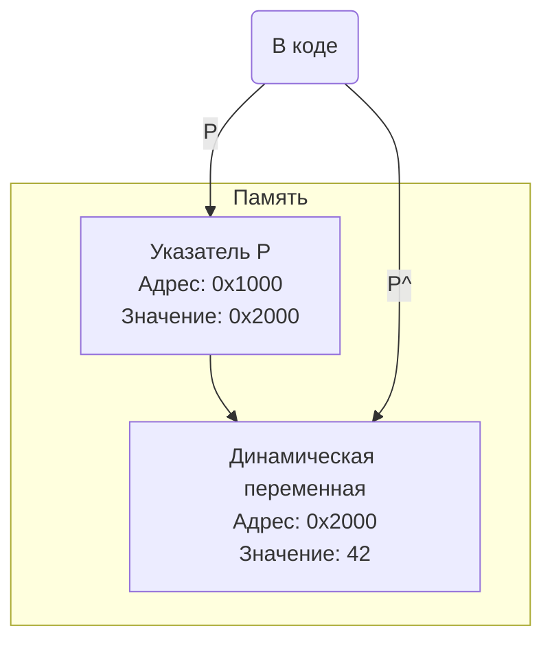
### Пример (простой односвязный список)
```pascal
program PointerExample;

type
  // Опережающее объявление указателя
  PNode = ^TNode;
  
  // Узел списка
  TNode = record
    Data: Integer;
    Next: PNode; // Поле-указатель на следующий узел
  end;

var
  Head: PNode; // Указатель на начало списка
  P: PNode;

begin
  // Создаем первый элемент списка
  New(Head);
  Head^.Data := 10;
  
  // Создаем второй элемент
  New(P);
  P^.Data := 20;
  Head^.Next := P; // Связываем первый элемент со вторым
  
  // Создаем третий элемент
  New(P);
  P^.Data := 30;
  Head^.Next^.Next := P; // Связываем второй с третьим
  
  P^.Next := nil; // Последний элемент никуда не указывает
  
  // --- Проход по списку и вывод данных ---
  P := Head;
  while P <> nil do
  begin
    Write(P^.Data, ' -> ');
    P := P^.Next; // Переходим к следующему элементу
  end;
  WriteLn('nil');
  
  // ... здесь должна быть очистка памяти через Dispose ...
  
  ReadLn;
end.
```
---
# 28. Процедуры New и Dispose. Назначение. Достоинства и недостатки их использования. Пример.

Процедуры `New` и `Dispose` — это основной высокоуровневый механизм для работы с **динамической памятью** в Pascal, тесно связанный с **типизированными указателями**.

### Назначение

*   **`New(P)`:**
    *   **Назначение:** Выделяет в динамической области памяти (куче) блок, достаточный для размещения одного экземпляра данных того типа, на который "указывает" **типизированный** указатель `P`.
    *   **Действие:** Адрес выделенного блока памяти помещается в переменную-указатель `P`.

*   **`Dispose(P)`:**
    *   **Назначение:** Освобождает блок памяти, на который указывает `P` и который ранее был выделен процедурой `New`.
    *   **Действие:** Возвращает память обратно системе для дальнейшего использования. Указатель `P` после этого становится "висячим" (указывает на освобожденную память), и хорошей практикой является присвоение ему значения `nil` (`P := nil;`).

```mermaid
graph TD
    A(Указатель P: PInteger) -- "1. New(P)" --> B{Память в куче<br>Выделен блок<br>размером SizeOf(Integer)}
    B -- "2. Адрес блока<br>записан в P" --> A
    A -- "3. Dispose(P)" --> B
    B -- "4. Память<br>освобождена" --> C(Свободная память)
```
### Достоинства и недостатки

**Достоинства:**
*   **Простота и безопасность:** Это самый простой способ работы с динамической памятью. Не нужно вручную указывать размер выделяемой памяти — компилятор определяет его сам на основе типа указателя. Это снижает вероятность ошибок.
*   **Работа с конструкторами и деструкторами (в Object Pascal / Delphi):** При использовании с объектами `New` и `Dispose` могут автоматически вызывать конструкторы и деструкторы, выполняя необходимую инициализацию и финализацию.
*   **Читаемость кода:** Код `New(P)` более нагляден, чем `GetMem(P, SizeOf(P^))`.

**Недостатки:**
*   **Отсутствие гибкости:** `New` всегда выделяет память под ровно один элемент базового типа указателя. Невозможно выделить память под массив или блок произвольного размера с помощью `New`.
*   **Привязка к типу:** `New` и `Dispose` работают только с **типизированными** указателями. Их нельзя использовать с нетипизированным указателем `Pointer`.

### Пример

```pascal
program NewDisposeExample;

type
  PPerson = ^TPerson;
  TPerson = record
    Name: string;
    Age: Integer;
  end;

var
  PersonPtr: PPerson;

begin
  // 1. Выделение памяти
  WriteLn('Выделяем память для записи...');
  New(PersonPtr);
  
  // Проверка, что память выделена
  if PersonPtr <> nil then
  begin
    // 2. Работа с динамической переменной
    PersonPtr^.Name := 'Алексей';
    PersonPtr^.Age := 30;
    
    WriteLn('Имя: ', PersonPtr^.Name, ', Возраст: ', PersonPtr^.Age);
    
    // 3. Освобождение памяти
    WriteLn('Освобождаем память...');
    Dispose(PersonPtr);
    
    // 4. (Хорошая практика) Обнуление указателя
    PersonPtr := nil;
  end
  else
  begin
    WriteLn('Не удалось выделить память!');
  end;
  
  ReadLn;
end.
```
---
# 29. Процедуры GetMem и FreeMem. Назначение. Достоинства и недостатки их использования. Пример.

Процедуры `GetMem` и `FreeMem` — это более низкоуровневый и гибкий механизм управления динамической памятью по сравнению с `New`/`Dispose`.

### Назначение

*   **`GetMem(P, Size)`:**
    *   **Назначение:** Выделяет в куче непрерывный блок памяти заданного размера `Size` в байтах.
    *   **Параметры:**
        *   `P`: Указатель (может быть как типизированным, так и нетипизированным `Pointer`), в который будет помещен адрес выделенного блока.
        *   `Size`: Целочисленное выражение, указывающее требуемый размер блока в **байтах**.

*   **`FreeMem(P [, Size])`:**
    *   **Назначение:** Освобождает блок памяти, на который указывает `P` и который ранее был выделен процедурой `GetMem`.
    *   **Параметры:**
        *   `P`: Указатель на освобождаемый блок.
        *   `Size` (необязательный, но **рекомендуемый** в старых версиях Delphi): Размер освобождаемого блока. Должен **точно совпадать** с размером, указанным при вызове `GetMem`. В современных версиях Delphi менеджер памяти может отслеживать размер блоков сам.

### Достоинства и недостатки

**Достоинства:**
*   **Гибкость:** Позволяют выделить блок памяти **любого** нужного размера, что идеально подходит для создания динамических массивов или буферов.
*   **Универсальность:** Могут работать как с типизированными, так и с нетипизированными указателями (`Pointer`), что делает их незаменимыми для низкоуровневых системных задач.

**Недостатки:**
*   **Потенциальная опасность:** Программист несет полную ответственность за правильное вычисление размера выделяемой памяти. Ошибка в `Size` может привести к трудноуловимым ошибкам, связанным с порчей памяти.
*   **Менее наглядный код:** Код с `GetMem` и `SizeOf` может быть менее читаемым, чем простой вызов `New`.
*   **Не работают с объектами:** Не вызывают конструкторы и деструкторы объектов.

### Сравнение `New`/`Dispose` и `GetMem`/`FreeMem`

| Критерий                  | `New / Dispose`                              | `GetMem / FreeMem`                                   |
| ------------------------- | -------------------------------------------- | ---------------------------------------------------- |
| **Указание размера**      | Автоматически, по типу указателя             | Вручную, в байтах                                    |
| **Тип указателя**         | Только типизированный                        | Любой (типизированный или `Pointer`)                 |
| **Основное применение**   | Создание одиночных динамических переменных, структур (списки, деревья) | Создание динамических массивов, буферов, низкоуровневые задачи |
| **Безопасность**          | Высокая                                      | Низкая, требует аккуратности                       |

### Пример (создание динамического массива)

```pascal
program GetMemExample;

type
  PIntegerArray = ^TIntegerArray;
  TIntegerArray = array[0..0] of Integer; // "Безразмерный" массив для удобства

var
  P: PIntegerArray;
  ArraySize, i: Integer;

begin
  ArraySize := 10;
  
  // 1. Выделяем память под массив из 10 целых чисел
  GetMem(P, ArraySize * SizeOf(Integer));
  
  if P <> nil then
  begin
    // 2. Заполняем и используем динамический массив
    WriteLn('Заполняем массив:');
    for i := 0 to ArraySize - 1 do
    begin
      P^[i] := i * i;
      Write(P^[i], ' ');
    end;
    WriteLn;
    
    // 3. Освобождаем память
    FreeMem(P, ArraySize * SizeOf(Integer));
    P := nil;
    WriteLn('Память освобождена.');
  end
  else
  begin
    WriteLn('Не удалось выделить память!');
  end;

  ReadLn;
end.
```
---
# 30. Строковый тип в Delphi. Представление в памяти. Автоматическое управление памятью для Delphi-строк.

В современных версиях Delphi по умолчанию под типом `String` понимается **длинная строка** (`AnsiString` или `UnicodeString`), которая является **управляемым типом данных**. Это означает, что компилятор и среда выполнения берут на себя большую часть работы по управлению памятью для строк.

### Представление в памяти

Переменная типа `String` на самом деле является **указателем**. Этот указатель ссылается на динамически выделенный в куче блок памяти, который содержит не только сами символы строки, но и служебную информацию в заголовке, предшествующем данным.

Структура строки в памяти:
1.  **Счетчик ссылок (Reference Count, 4 байта):** Целое число, которое хранит количество строковых переменных, ссылающихся на **этот самый** блок памяти.
2.  **Длина строки (Length, 4 байта):** Целое число, хранящее текущую длину строки.
3.  **Символы строки:** Последовательность символов.
4.  **Нуль-терминатор (`#0`):** Завершающий нулевой символ для совместимости с функциями C-стиля и Windows API.

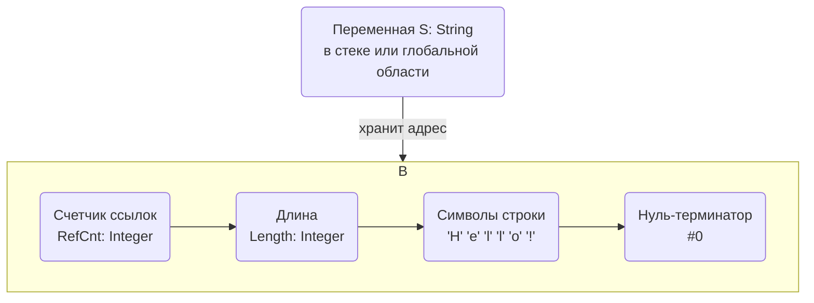

### Автоматическое управление памятью

Управление памятью для Delphi-строк основано на двух механизмах: **подсчете ссылок (reference counting)** и **копировании при записи (copy-on-write)**.

**1. Подсчет ссылок:**
*   Когда одна строковая переменная присваивается другой (`S2 := S1;`), физического копирования данных не происходит. Вместо этого просто копируется указатель, а **счетчик ссылок** у общего блока памяти **увеличивается на 1**. Это очень быстро и эффективно.
*   Когда переменная выходит из области видимости или ей присваивается другое значение, счетчик ссылок блока, на который она указывала, **уменьшается на 1**.
*   Как только счетчик ссылок становится равным **нулю**, это означает, что на данный блок памяти больше никто не ссылается, и менеджер памяти **автоматически освобождает** этот блок.

**2. Копирование при записи:**
*   Если программа пытается изменить строку (например, `S1[1] := 'A'`), а ее счетчик ссылок больше 1, происходит следующее:
    *   Создается **полная копия** блока данных строки.
    *   Изменение применяется уже к этой **новой копии**.
    *   Строковая переменная (`S1`) начинает указывать на новый, измененный блок.
    *   Счетчик ссылок у старого блока уменьшается на 1.
*   Если же счетчик ссылок равен 1, то строка изменяется "по месту" без копирования, так как на нее больше никто не претендует.

Таким образом, Delphi-строки сочетают в себе производительность (за счет ленивого копирования) и безопасность (за счет автоматического освобождения памяти), снимая с программиста рутину ручного управления памятью и предотвращая утечки.
---
# 31. Директива absolute. Принцип работы. Пример.

**Директива `absolute`** — это специальная директива компилятора, которая позволяет объявить переменную, разместив ее не в новой, выделенной для нее области памяти, а "поверх" уже существующей. По сути, это способ создать **другое имя (псевдоним)** для уже существующей области памяти, возможно, с другим типом.

### Принцип работы

Обычное объявление переменной (`var X: Integer;`) заставляет компилятор выделить новый участок памяти и связать с ним идентификатор `X`.

Директива `absolute` меняет это поведение. Она может использоваться в двух вариантах:

**1. `absolute` с именем другой переменной**
```pascal
var
  S: string[10];
  L: Byte absolute S;
```
*   **Принцип:** Компилятор не выделяет новую память для `L`. Вместо этого переменная `L` будет располагаться по тому же адресу, что и переменная `S`. Конкретно, `L` будет наложена на первый байт `S` (длину строки). Изменение `L` приведет к изменению первого байта `S`, и наоборот. Это позволяет интерпретировать одну и ту же область памяти как данные разных типов.

**2. `absolute` с адресом в памяти**
```pascal
var
  VideoMem: array[0..1999] of Word absolute $B800:$0000;
```
*   **Принцип:** Переменная `VideoMem` размещается по указанному абсолютному адресу в памяти (`сегмент:смещение`). Этот способ использовался в DOS для прямого доступа к аппаратуре, например, к видеопамяти. В современных защищенных операционных системах (Windows, Linux) прямое обращение к физическим адресам из прикладной программы **запрещено** и приведет к ошибке доступа. Этот вариант имеет в основном историческое значение.

### Пример (интерпретация данных разного типа)

Наиболее частое и полезное применение `absolute` — это анализ внутреннего представления данных или работа с бестиповыми параметрами.

```pascal
program AbsoluteExample;

var
  Num: Integer;
  // Объявляем массив из двух байт, который будет
  // физически расположен там же, где и переменная Num
  Bytes: array[0..1] of Byte absolute Num;

begin
  // Присваиваем значение Integer.
  // В памяти это будет выглядеть как два байта.
  // Для числа 258 (в hex $0102) это байты $02 и $01 (little-endian порядок)
  Num := 258;
  
  WriteLn('Значение Integer: ', Num);
  
  // Через псевдоним 'Bytes' мы можем посмотреть на эти же
  // байты по-отдельности.
  WriteLn('Младший байт (Bytes[0]): ', Bytes[0]); // Выведет 2
  WriteLn('Старший байт (Bytes[1]): ', Bytes[1]); // Выведет 1
  
  // Мы можем изменить байты и посмотреть, как изменится Integer
  Bytes[0] := 0;
  Bytes[1] := 1; // Теперь в памяти $0100 = 256
  
  WriteLn('Новое значение Integer после изменения байтов: ', Num); // Выведет 256
  
  ReadLn;
end.
```
---
# 32. Зарезервированное слово packed. Влияние на представление в памяти записей и массивов.

Зарезервированное слово `packed` — это модификатор, который можно применять к структурированным типам данных (записям, массивам, файлам), чтобы указать компилятору на необходимость **максимально плотной упаковки** их элементов в памяти, даже если это приведет к снижению скорости доступа.

### Выравнивание данных (по умолчанию)

Современные процессоры работают с памятью наиболее эффективно, когда данные расположены по адресам, кратным их размеру (например, 4-байтное число `LongWord` по адресу, делящемуся на 4). Этот процесс называется **выравниванием данных (alignment)**.

По умолчанию компилятор Delphi выравнивает поля в записях, чтобы оптимизировать скорость доступа к ним. Для этого он может вставлять между полями "пустые" неиспользуемые байты.

**Пример без `packed`:**
```pascal
type
  TMyRecord = record // По умолчанию {$A+} или {$ALIGN ON}
    A: Byte;     // 1 байт
    // Компилятор вставляет 1 пустой байт для выравнивания
    B: Word;     // 2 байта
    // Компилятор вставляет 2 пустых байта для выравнивания
    C: LongWord; // 4 байта
  end;
// SizeOf(TMyRecord) будет равен 8 байтам, а не 1+2+4=7.
```
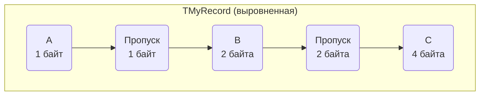
### Влияние `packed`

Когда мы объявляем структуру как `packed`, мы даем компилятору команду **отключить выравнивание** и располагать элементы вплотную друг к другу, экономя память.

```pascal
type
  TMyPackedRecord = packed record
    A: Byte;     // 1 байт
    B: Word;     // 2 байта
    C: LongWord; // 4 байта
  end;
// SizeOf(TMyPackedRecord) будет равен 7 байтам.
```
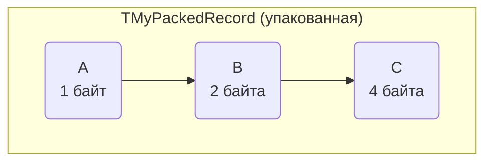
### `packed` для массивов

Для массивов `packed` также пытается упаковать элементы как можно плотнее. Наибольший эффект это имеет для `array of Boolean`, где каждый элемент вместо байта будет занимать один бит.

### Преимущества и недостатки `packed`

**Преимущества:**
*   **Экономия памяти:** `packed`-структуры занимают минимально возможный объем памяти.
*   **Предсказуемость структуры:** Внутреннее устройство `packed`-записи точно соответствует последовательности объявления ее полей, без "сюрпризов" в виде пропущенных байтов. Это критически важно при работе с файловыми форматами или при передаче данных по сети, где структура должна быть строго определена.
*   **Совместимость:** Позволяет обеспечить бинарную совместимость данных с другими системами или языками программирования (например, C/C++), где также используется плотная упаковка.

**Недостатки:**
*   **Снижение производительности:** Доступ к неупакованным полям может потребовать от процессора больше тактов, что замедляет выполнение программы.

**Вывод:** `packed` следует использовать тогда, когда экономия памяти или точный контроль над структурой данных в памяти важнее, чем максимальная скорость доступа.
